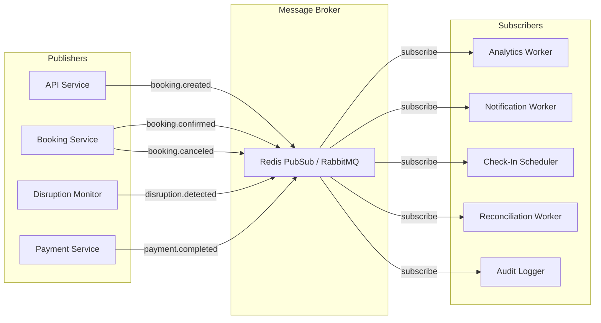

# Corporate Travel Management Platform - Complete Architecture

## Table of Contents
1. [Executive Summary](#executive-summary)
2. [End-to-End User Flow](#end-to-end-user-flow)
3. [System Architecture](#system-architecture)
4. [Service Breakdown](#service-breakdown)
5. [Database Schema](#database-schema)
6. [API Specifications](#api-specifications)
7. [Event-Driven Architecture](#event-driven-architecture)
8. [UI State Management](#ui-state-management)
9. [Implementation Roadmap](#implementation-roadmap)

---

## Executive Summary

### What This Platform Does
A comprehensive corporate travel management platform that:
- **Automates booking** flights, hotels, and ground transportation
- **Enforces travel policies** with real-time compliance checking
- **Manages approvals** through workflow automation
- **Monitors disruptions** and auto-rebooking capabilities
- **Tracks spending** with analytics and budget controls
- **Issues virtual cards** for secure payments
- **Ensures duty of care** with traveler tracking

### Key User Personas
1. **Travelers** - Book trips via AI Concierge or Explore
2. **Travel Admins** - Manage bookings, handle disruptions
3. **Approvers** - Review and approve policy exceptions
4. **Finance Teams** - Track spending, reconcile payments
5. **Platform Admins** - Manage clients and overall platform

---

## End-to-End User Flow

### Complete Booking Journey

```
┌─────────────────────────────────────────────────────────────────────────┐
│                         USER BOOKING JOURNEY                             │
└─────────────────────────────────────────────────────────────────────────┘

1. DISCOVERY (Explore / AI Concierge)
   ↓
2. SEARCH & SELECT
   ↓
3. POLICY EVALUATION
   ↓
4. DRAFT CREATION
   ↓
5. APPROVAL (if needed)
   ↓
6. PAYMENT & BOOKING
   ↓
7. MONITORING & TRAVEL
   ↓
8. POST-TRIP RECONCILIATION
```

### Detailed Flow Narrative

#### **Phase 1: Discovery & Search**

**User Actions:**
- Opens **Explore** page or **AI Travel Concierge**
- Searches: "London trip next week, 3 nights"

**System Actions:**
```
Frontend (Next.js)
  ↓
POST /bookings/search
  ↓
API Gateway (FastAPI)
  ↓
Parallel Calls:
  ├─→ Flight Provider (Duffel/Amadeus)
  ├─→ Hotel Provider (Hotelbeds/Expedia)
  └─→ Weather API (optional)
  ↓
Aggregate Results
  ↓
POST /policies/bulk-evaluate
  ↓
Policy Engine evaluates each option
  ↓
Return tagged results:
  - Green ✅ (compliant)
  - Amber ⚠️ (soft warning)
  - Red 🛑 (hard stop)
```

**Response Format:**
```json
{
  "flights": [
    {
      "id": "FL-001",
      "provider": "Duffel",
      "price": 1850,
      "class": "Economy",
      "duration": "7h 20m",
      "policy_status": "OK",
      "co2": 450
    },
    {
      "id": "FL-002",
      "provider": "Amadeus",
      "price": 3200,
      "class": "Business",
      "duration": "7h 20m",
      "policy_status": "SOFT_WARNING",
      "policy_message": "Business class requires VP approval",
      "co2": 820
    }
  ],
  "hotels": [
    {
      "id": "HT-001",
      "provider": "Hotelbeds",
      "name": "Hilton London Metropole",
      "price_per_night": 245,
      "policy_status": "OK",
      "preferred": true
    }
  ],
  "weather": {
    "forecast": "Light rain expected",
    "severity": "low"
  }
}
```

#### **Phase 2: Selection & Draft**

**User Actions:**
- Selects: Economy flight + Hilton hotel
- Clicks "Add to Cart" / "Save Draft"

**System Actions:**
```
Frontend
  ↓
POST /bookings/draft
  ↓
API validates selections
  ↓
INSERT INTO bookings (status='draft')
  ↓
INSERT INTO booking_segments (flight, hotel)
  ↓
POST /policies/evaluate (full draft)
  ↓
Policy Engine checks:
  - Advance booking window (7-14 days)
  - Daily rate limits
  - Preferred vendors
  - Budget thresholds
  ↓
IF HARD_STOP:
  - Return error + policy details
  - Block booking
ELSE IF SOFT_WARNING:
  - Save warning flag
  - Require acknowledgment
ELSE:
  - Mark as compliant
  ↓
Return draft_id + policy results
```

**Draft Record:**
```sql
bookings
├─ id: UUID
├─ status: 'draft'
├─ total_amount: 2095
├─ policy_status: 'SOFT_WARNING'
├─ policy_warnings: ['Business class requires approval']
└─ created_at: NOW()
```

#### **Phase 3: Confirmation & Approval**

**User Actions:**
- Reviews draft
- Acknowledges warnings
- Clicks "Confirm Booking"

**System Actions:**
```
Frontend
  ↓
POST /bookings/{id}/confirm
  {
    "idempotency_key": "uuid-1234",
    "accept_warnings": true
  }
  ↓
API re-evaluates policies (final check)
  ↓
IF approval_required:
  ├─→ Create approval_workflow
  ├─→ Determine approvers (manager, finance, etc.)
  ├─→ Send notifications (email, Slack)
  ├─→ UPDATE bookings SET status='pending_approval'
  └─→ Return 202 Accepted
  
ELSE (auto-approved):
  ↓
  Proceed to booking
```

**Approval Workflow:**
```sql
approval_workflows
├─ id: UUID
├─ booking_id: ref
├─ status: 'pending'
├─ steps: [
│    {step: 1, approver: 'manager', status: 'pending'},
│    {step: 2, approver: 'finance', status: 'not_started'}
│  ]
├─ sla_deadline: NOW() + 48h
└─ created_at: NOW()
```

#### **Phase 4: Payment & Booking Execution**

**Triggered after approval (or immediate if auto-approved):**

```
Booking Service
  ↓
POST /payments/virtual-cards
  {
    "booking_id": "BK-001",
    "amount": 2095,
    "merchant_category": "travel"
  }
  ↓
Stripe/Payment Provider
  ↓
Returns virtual card:
  {
    "card_id": "VC-001",
    "card_number": "4242...",
    "cvv": "123",
    "expiry": "12/25",
    "limit": 2095
  }
  ↓
Store in virtual_cards table
  ↓
─────────────────────────────────────
BOOK FLIGHT (with retry logic)
  ↓
POST /flights/book
  {
    "offer_id": "FL-001",
    "payment": {card details},
    "idempotency_key": "uuid-1234"
  }
  ↓
Flight Provider confirms
  ↓
Returns:
  {
    "booking_ref": "BA178ABC",
    "pnr": "XYZ123",
    "eticket": "1234567890"
  }
  ↓
UPDATE booking_segments
  SET supplier_ref = 'BA178ABC'
─────────────────────────────────────
BOOK HOTEL (parallel)
  ↓
POST /hotels/book
  {
    "room_id": "HT-001",
    "payment": {card details},
    "idempotency_key": "uuid-1234-hotel"
  }
  ↓
Hotel Provider confirms
  ↓
Returns:
  {
    "confirmation": "HLT-456",
    "checkin": "2025-10-18",
    "checkout": "2025-10-22"
  }
  ↓
UPDATE booking_segments
  SET supplier_ref = 'HLT-456'
─────────────────────────────────────
FINALIZE BOOKING
  ↓
UPDATE bookings
  SET status = 'confirmed'
  ↓
Publish event: booking.created
  ↓
Send itinerary email (Twilio/SendGrid)
  ↓
Return 200 + booking details
```

#### **Phase 5: Post-Booking Monitoring**

**Background Workers Consume `booking.created` Event:**

```
Worker 1: Analytics Aggregator
  ├─→ UPDATE analytics_spend
  ├─→ Calculate CO2 emissions
  └─→ Update compliance metrics

Worker 2: Check-In Scheduler
  ├─→ Schedule check-in reminders
  └─→ Create duty of care alerts

Worker 3: Payment Reconciliation
  ├─→ Listen for payment webhooks
  └─→ Match transactions to invoices

Worker 4: Disruption Monitor (continuous)
  ├─→ Poll flight status APIs
  ├─→ Listen to disruption webhooks
  └─→ If disruption detected:
      ├─→ INSERT disruption_events
      ├─→ UPDATE bookings status='requires_attention'
      └─→ Trigger auto-rebook flow
```

**Disruption Flow:**
```
Disruption Detected (e.g., flight canceled)
  ↓
INSERT INTO disruption_events
  {
    "booking_id": "BK-001",
    "event_type": "flight_canceled",
    "severity": "critical",
    "details": {...}
  }
  ↓
Notification Service
  ├─→ Send SMS to traveler
  ├─→ Send email to traveler
  └─→ Alert travel admin dashboard
  ↓
Auto-Rebook Engine (if enabled)
  ├─→ Search alternative flights
  ├─→ Filter by policy compliance
  ├─→ Rank by: price, timing, convenience
  ├─→ Present suggestions to traveler
  └─→ If approved, execute rebooking
```

#### **Phase 6: Travel & Duty of Care**

**During Travel:**
- **Dashboard** shows "Currently Traveling: 23"
- **Real-time tracking** via booking data
- **Check-in alerts** sent 24h before departure
- **Weather alerts** if severe conditions
- **Emergency contacts** available in app

**UI State: Bookings Dashboard**
```
┌─────────────────────────────────────────┐
│ BOOKINGS & OPERATIONS                   │
├─────────────────────────────────────────┤
│ Total Bookings: 10                      │
│ Critical Alerts: 0                      │
│ All Disruptions: 5                      │
├─────────────────────────────────────────┤
│ Filters: [All] [Confirmed] [...] (5)    │
├─────────────────────────────────────────┤
│ ┌─────────────────────────────────────┐ │
│ │ Michael Chen - London, UK           │ │
│ │ BK-2024-1847 • Oct 18-22, 2025      │ │
│ │ ⚠️ Strike alert: Auto-rebook enabled│ │
│ │ BA 178 • Hilton Metropole           │ │
│ │ Status: Confirmed | $2,450          │ │
│ └─────────────────────────────────────┘ │
└─────────────────────────────────────────┘
```

#### **Phase 7: Post-Trip Reconciliation**

```
Payment Webhooks arrive
  ↓
Match transactions to bookings
  ↓
Update invoice status
  ↓
IF discrepancies:
  ├─→ Flag transaction
  └─→ Require manual review
  ↓
Generate expense report
  ↓
Send to employee for review
  ↓
Submit to finance system
```

---

## System Architecture

### High-Level Architecture Diagram

```mermaid
graph TB
    subgraph "Client Layer"
        WEB[Next.js Web App]
        MOBILE[Mobile App - Future]
    end

    subgraph "API Gateway & Load Balancer"
        NGINX[Nginx / API Gateway]
    end

    subgraph "Application Services"
        API[FastAPI - Main API]
        POLICY[Policy Engine Service]
        BOOKING[Booking Service]
        PAYMENT[Payment Service]
        APPROVAL[Approval Service]
        NOTIF[Notification Service]
        ANALYTICS[Analytics Service]
    end

    subgraph "Background Workers"
        CELERY[Celery Workers]
        ANALYTICS_WORKER[Analytics Aggregator]
        DISRUPTION[Disruption Monitor]
        RECONCILE[Payment Reconciliation]
        CHECKIN[Check-In Scheduler]
    end

    subgraph "Data Layer"
        PG[(PostgreSQL)]
        REDIS[(Redis Cache & Queue)]
        S3[(S3 / Object Storage)]
    end

    subgraph "External Integrations"
        FLIGHTS[Flight APIs<br/>Duffel, Amadeus]
        HOTELS[Hotel APIs<br/>Hotelbeds, Expedia]
        CARS[Car Rentals<br/>Avis, Hertz]
        STRIPE[Stripe Payments]
        TWILIO[Twilio SMS/Email]
        WEATHER[Weather APIs]
        VISA[Visa/Sherpa]
        HR[Workday/SCIM HR Sync]
    end

    subgraph "Monitoring & Observability"
        LOGGING[Logging - CloudWatch/Datadog]
        APM[APM - New Relic]
        METRICS[Metrics - Prometheus]
    end

    WEB --> NGINX
    MOBILE --> NGINX
    NGINX --> API

    API --> POLICY
    API --> BOOKING
    API --> PAYMENT
    API --> APPROVAL
    API --> NOTIF
    API --> ANALYTICS

    API --> PG
    API --> REDIS
    API --> S3

    BOOKING --> FLIGHTS
    BOOKING --> HOTELS
    BOOKING --> CARS
    PAYMENT --> STRIPE
    NOTIF --> TWILIO
    API --> WEATHER
    API --> VISA
    API --> HR

    API --> CELERY
    CELERY --> ANALYTICS_WORKER
    CELERY --> DISRUPTION
    CELERY --> RECONCILE
    CELERY --> CHECKIN

    ANALYTICS_WORKER --> PG
    DISRUPTION --> PG
    DISRUPTION --> FLIGHTS
    RECONCILE --> PG
    RECONCILE --> STRIPE

    API --> LOGGING
    API --> APM
    API --> METRICS
```



### Service Responsibilities

#### **1. FastAPI Main API**
- Request routing and validation
- Authentication & authorization (JWT)
- Rate limiting
- Response formatting
- Coordinates microservices

#### **2. Policy Engine Service**
```python
Responsibilities:
- Evaluate bookings against policies
- Support rule types: HARD_STOP, SOFT_WARNING, TRACK_ONLY
- Policy versions & regional rules
- Real-time and batch evaluation

Key Methods:
- evaluate_single(booking_request) → PolicyResult
- evaluate_bulk(options[]) → PolicyResult[]
- get_applicable_policies(employee, trip) → Policy[]
```

#### **3. Booking Service**
```python
Responsibilities:
- Search aggregation across providers
- Supplier adapter pattern
- Idempotency handling
- Retry logic with circuit breakers
- State machine for booking lifecycle

Adapters:
- FlightAdapter (Duffel, Amadeus)
- HotelAdapter (Hotelbeds, Expedia)
- CarAdapter (Avis, Hertz)

State Machine:
draft → pending_approval → confirmed → completed
                        ↘ canceled
                        ↘ requires_attention
```

#### **4. Payment Service**
```python
Responsibilities:
- Virtual card issuance (Stripe Issuing)
- Corporate card management
- Transaction matching
- Reconciliation
- Fraud detection

Key Flows:
- create_virtual_card(booking_id, amount)
- charge_corporate_card(card_id, amount)
- match_transaction(txn_id, booking_id)
- flag_discrepancy(txn_id, reason)
```

#### **5. Approval Service**
```python
Responsibilities:
- Multi-step approval workflows
- SLA tracking
- Auto-escalation
- Delegation handling

Workflow Example:
{
  "steps": [
    {"approver": "manager", "threshold": 5000},
    {"approver": "finance", "threshold": 10000},
    {"approver": "executive", "threshold": null}
  ],
  "sla": "48h",
  "escalation": "VP_Operations"
}
```

#### **6. Notification Service**
```python
Providers:
- Email: SendGrid
- SMS: Twilio
- Push: Firebase (future)
- In-app: WebSocket

Templates:
- booking_confirmation
- approval_request
- disruption_alert
- payment_receipt
- policy_violation
```

#### **7. Analytics Service**
```python
Aggregations:
- Spend by department/employee/period
- Savings vs market rates
- Compliance metrics
- CO2 emissions tracking
- Policy breach trends

Reports:
- Executive dashboard
- Department budgets
- Traveler behavior
- Supplier performance
```

---

## Database Schema

### Core Tables

```sql
-- ============================================
-- BOOKINGS
-- ============================================
CREATE TABLE bookings (
    id UUID PRIMARY KEY DEFAULT gen_random_uuid(),
    org_id UUID NOT NULL REFERENCES organizations(id),
    employee_id INTEGER NOT NULL REFERENCES employees(id),
    created_by INTEGER REFERENCES employees(id), -- delegate
    
    -- Status & Lifecycle
    status TEXT NOT NULL CHECK (status IN (
        'draft', 'pending_approval', 'confirmed', 
        'in_progress', 'completed', 'canceled', 'requires_attention'
    )),
    
    -- Financials
    total_amount NUMERIC(10,2) NOT NULL,
    currency VARCHAR(3) DEFAULT 'USD',
    cost_center VARCHAR(50),
    
    -- Policy
    policy_status TEXT CHECK (policy_status IN ('ok', 'warn', 'blocked')),
    policy_warnings JSONB,
    
    -- Metadata
    trip_purpose TEXT,
    notes TEXT,
    idempotency_key VARCHAR(255) UNIQUE,
    
    -- Timestamps
    created_at TIMESTAMPTZ DEFAULT NOW(),
    updated_at TIMESTAMPTZ DEFAULT NOW(),
    confirmed_at TIMESTAMPTZ,
    
    -- Indexes
    INDEX idx_bookings_org_employee (org_id, employee_id),
    INDEX idx_bookings_status (status),
    INDEX idx_bookings_created (created_at DESC)
);

-- ============================================
-- BOOKING SEGMENTS (flights, hotels, cars)
-- ============================================
CREATE TABLE booking_segments (
    id UUID PRIMARY KEY DEFAULT gen_random_uuid(),
    booking_id UUID NOT NULL REFERENCES bookings(id) ON DELETE CASCADE,
    
    -- Type & Provider
    segment_type TEXT NOT NULL CHECK (segment_type IN ('flight', 'hotel', 'car')),
    provider TEXT NOT NULL, -- 'Duffel', 'Hotelbeds', etc.
    supplier_ref TEXT, -- external booking reference
    
    -- Travel Details
    from_city TEXT,
    to_city TEXT,
    depart_at TIMESTAMPTZ,
    arrive_at TIMESTAMPTZ,
    
    -- Flight Specific
    fare_class TEXT,
    cabin_class TEXT, -- Economy, Business, First
    airline_code VARCHAR(3),
    flight_number VARCHAR(10),
    
    -- Hotel Specific
    hotel_name TEXT,
    room_type TEXT,
    checkin_date DATE,
    checkout_date DATE,
    nights INTEGER,
    
    -- Car Specific
    car_category TEXT,
    pickup_location TEXT,
    dropoff_location TEXT,
    
    -- Pricing
    price NUMERIC(10,2) NOT NULL,
    currency VARCHAR(3) DEFAULT 'USD',
    
    -- Metadata
    details JSONB, -- full provider response
    created_at TIMESTAMPTZ DEFAULT NOW(),
    
    INDEX idx_segments_booking (booking_id),
    INDEX idx_segments_type (segment_type),
    INDEX idx_segments_depart (depart_at)
);

-- ============================================
-- POLICIES
-- ============================================
CREATE TABLE policies (
    id UUID PRIMARY KEY DEFAULT gen_random_uuid(),
    org_id UUID NOT NULL REFERENCES organizations(id),
    
    name TEXT NOT NULL,
    description TEXT,
    type TEXT NOT NULL CHECK (type IN ('hard', 'soft', 'track')),
    category TEXT, -- 'advance_booking', 'daily_limit', 'vendor', etc.
    
    -- Rule Definition (JSON Logic)
    rule_json JSONB NOT NULL,
    
    -- Scope
    regions TEXT[],
    departments TEXT[],
    employee_levels TEXT[],
    
    -- Status
    active BOOLEAN DEFAULT true,
    version INTEGER DEFAULT 1,
    
    priority INTEGER DEFAULT 100, -- lower = higher priority
    
    created_at TIMESTAMPTZ DEFAULT NOW(),
    updated_at TIMESTAMPTZ DEFAULT NOW(),
    
    INDEX idx_policies_org_active (org_id, active),
    INDEX idx_policies_type (type)
);

-- Example policy rules:
-- {
--   "condition": "AND",
--   "rules": [
--     {"field": "segment.fare_class", "operator": "equals", "value": "Business"},
--     {"field": "segment.duration_mins", "operator": "<", "value": 180}
--   ],
--   "action": "SOFT_WARNING",
--   "message": "Business class discouraged for flights under 3 hours"
-- }

-- ============================================
-- POLICY EVALUATIONS
-- ============================================
CREATE TABLE policy_evaluations (
    id UUID PRIMARY KEY DEFAULT gen_random_uuid(),
    booking_id UUID NOT NULL REFERENCES bookings(id),
    policy_id UUID NOT NULL REFERENCES policies(id),
    
    result TEXT NOT NULL CHECK (result IN ('PASS', 'WARN', 'STOP')),
    details JSONB,
    
    evaluated_at TIMESTAMPTZ DEFAULT NOW(),
    
    INDEX idx_eval_booking (booking_id),
    INDEX idx_eval_result (result)
);

-- ============================================
-- APPROVAL WORKFLOWS
-- ============================================
CREATE TABLE approval_workflows (
    id UUID PRIMARY KEY DEFAULT gen_random_uuid(),
    booking_id UUID NOT NULL REFERENCES bookings(id),
    
    status TEXT NOT NULL CHECK (status IN (
        'pending', 'in_progress', 'approved', 'rejected', 'escalated'
    )),
    
    current_step INTEGER DEFAULT 1,
    steps JSONB NOT NULL, -- array of approval steps
    
    -- SLA
    sla_deadline TIMESTAMPTZ,
    escalation_approver_id INTEGER REFERENCES employees(id),
    
    created_at TIMESTAMPTZ DEFAULT NOW(),
    updated_at TIMESTAMPTZ DEFAULT NOW(),
    resolved_at TIMESTAMPTZ,
    
    INDEX idx_approvals_booking (booking_id),
    INDEX idx_approvals_status (status),
    INDEX idx_approvals_sla (sla_deadline)
);

-- ============================================
-- VIRTUAL CARDS
-- ============================================
CREATE TABLE virtual_cards (
    id UUID PRIMARY KEY DEFAULT gen_random_uuid(),
    booking_id UUID REFERENCES bookings(id),
    org_id UUID NOT NULL REFERENCES organizations(id),
    
    provider_card_id TEXT NOT NULL, -- Stripe card ID
    card_holder_name TEXT,
    
    -- Card Details (encrypted in production)
    card_number_last4 VARCHAR(4),
    expiry_month INTEGER,
    expiry_year INTEGER,
    
    -- Limits
    limit_amount NUMERIC(10,2) NOT NULL,
    spent_amount NUMERIC(10,2) DEFAULT 0,
    
    status TEXT CHECK (status IN ('active', 'frozen', 'canceled', 'expired')),
    
    created_at TIMESTAMPTZ DEFAULT NOW(),
    expires_at TIMESTAMPTZ,
    
    INDEX idx_vcards_booking (booking_id),
    INDEX idx_vcards_status (status)
);

-- ============================================
-- DISRUPTION EVENTS
-- ============================================
CREATE TABLE disruption_events (
    id UUID PRIMARY KEY DEFAULT gen_random_uuid(),
    booking_id UUID REFERENCES bookings(id),
    segment_id UUID REFERENCES booking_segments(id),
    
    event_type TEXT NOT NULL, -- 'flight_canceled', 'flight_delayed', 'hotel_overbooked', etc.
    severity TEXT NOT NULL CHECK (severity IN ('low', 'medium', 'high', 'critical')),
    
    supplier TEXT,
    supplier_ref TEXT,
    
    details JSONB,
    
    -- Resolution
    resolved BOOLEAN DEFAULT false,
    resolution_type TEXT, -- 'auto_rebook', 'manual', 'refund', etc.
    resolution_details JSONB,
    
    created_at TIMESTAMPTZ DEFAULT NOW(),
    resolved_at TIMESTAMPTZ,
    
    INDEX idx_disruption_booking (booking_id),
    INDEX idx_disruption_severity (severity),
    INDEX idx_disruption_resolved (resolved)
);

-- ============================================
-- EMPLOYEES
-- ============================================
CREATE TABLE employees (
    id SERIAL PRIMARY KEY,
    org_id UUID NOT NULL REFERENCES organizations(id),
    
    email TEXT NOT NULL UNIQUE,
    name TEXT NOT NULL,
    
    department TEXT,
    role TEXT,
    level TEXT, -- 'junior', 'senior', 'manager', 'vp', 'executive'
    
    manager_id INTEGER REFERENCES employees(id),
    
    -- Travel Preferences
    travel_preferences JSONB,
    -- {
    --   "seat_preference": "aisle",
    --   "meal_preference": "vegetarian",
    --   "loyalty_programs": {...}
    -- }
    
    -- Compliance
    compliance_score NUMERIC(5,2) DEFAULT 100.00,
    
    -- Status
    active BOOLEAN DEFAULT true,
    created_at TIMESTAMPTZ DEFAULT NOW(),
    
    INDEX idx_employees_org (org_id),
    INDEX idx_employees_manager (manager_id)
);

-- ============================================
-- ANALYTICS - Aggregated Spend
-- ============================================
CREATE TABLE analytics_spend (
    id UUID PRIMARY KEY DEFAULT gen_random_uuid(),
    org_id UUID NOT NULL REFERENCES organizations(id),
    
    period_type TEXT NOT NULL CHECK (period_type IN ('daily', 'weekly', 'monthly', 'yearly')),
    period_start DATE NOT NULL,
    period_end DATE NOT NULL,
    
    -- Dimensions
    department TEXT,
    employee_id INTEGER REFERENCES employees(id),
    supplier TEXT,
    segment_type TEXT,
    
    -- Metrics
    total_bookings INTEGER DEFAULT 0,
    total_spend NUMERIC(12,2) DEFAULT 0,
    avg_trip_cost NUMERIC(10,2),
    
    savings NUMERIC(10,2) DEFAULT 0, -- vs market rates
    co2_emissions NUMERIC(10,2) DEFAULT 0, -- in kg
    
    policy_violations INTEGER DEFAULT 0,
    compliance_rate NUMERIC(5,2),
    
    created_at TIMESTAMPTZ DEFAULT NOW(),
    
    UNIQUE (org_id, period_start, period_end, department, employee_id),
    INDEX idx_analytics_period (period_start, period_end),
    INDEX idx_analytics_dept (department)
);

-- ============================================
-- ORGANIZATIONS (Multi-Tenant)
-- ============================================
CREATE TABLE organizations (
    id UUID PRIMARY KEY DEFAULT gen_random_uuid(),
    name TEXT NOT NULL,
    slug TEXT UNIQUE,
    
    tier TEXT CHECK (tier IN ('starter', 'professional', 'enterprise')),
    
    settings JSONB, -- org-level configs
    
    active BOOLEAN DEFAULT true,
    created_at TIMESTAMPTZ DEFAULT NOW(),
    
    INDEX idx_orgs_active (active)
);
```

---

## API Specifications

### Critical Endpoints

#### **1. Search Bookings**

**Endpoint:** `POST /bookings/search`

**Request:**
```json
{
  "employee_id": 42,
  "origin": "JFK",
  "destination": "LHR",
  "depart_date": "2025-10-18",
  "return_date": "2025-10-22",
  "passengers": 1,
  "preferences": {
    "cabin_class": "Economy",
    "max_stops": 1
  }
}
```

**Response:**
```json
{
  "search_id": "SRCH-001",
  "flights": [
    {
      "offer_id": "FL-001",
      "provider": "Duffel",
      "airline": "BA",
      "flight_number": "BA178",
      "departure": "2025-10-18T18:00:00Z",
      "arrival": "2025-10-19T06:20:00Z",
      "duration_mins": 440,
      "fare_class": "Economy",
      "price": 1850,
      "currency": "USD",
      "policy_status": "OK",
      "co2_kg": 450,
      "preferred_vendor": true
    }
  ],
  "hotels": [
    {
      "offer_id": "HT-001",
      "provider": "Hotelbeds",
      "name": "Hilton London Metropole",
      "checkin": "2025-10-18",
      "checkout": "2025-10-22",
      "nights": 4,
      "price_per_night": 245,
      "total_price": 980,
      "policy_status": "OK",
      "preferred_vendor": true
    }
  ],
  "weather": {
    "destination": "London",
    "forecast": "Light rain expected Oct 19-20",
    "severity": "low"
  }
}
```

#### **2. Create Draft**

**Endpoint:** `POST /bookings/draft`

**Request:**
```json
{
  "employee_id": 42,
  "org_id": "org-abc",
  "selections": {
    "flight": "FL-001",
    "hotel": "HT-001"
  },
  "cost_center": "GL-4100-T&E",
  "trip_purpose": "Client meeting",
  "notes": "Prefer morning flights"
}
```

**Response:**
```json
{
  "booking_id": "BK-2024-1847",
  "status": "draft",
  "total_amount": 2830,
  "policy_evaluation": {
    "status": "OK",
    "warnings": [],
    "requires_approval": false
  },
  "segments": [
    {"type": "flight", "id": "SEG-001", "price": 1850},
    {"type": "hotel", "id": "SEG-002", "price": 980}
  ]
}
```

#### **3. Confirm Booking**

**Endpoint:** `POST /bookings/{booking_id}/confirm`

**Request:**
```json
{
  "employee_id": 42,
  "payment_method": {
    "type": "virtual_card"
  },
  "accept_warnings": true,
  "idempotency_key": "uuid-1234"
}
```

**Response (Auto-Approved):**
```json
{
  "booking_id": "BK-2024-1847",
  "status": "confirmed",
  "confirmation_code": "ABC123",
  "segments": [
    {
      "type": "flight",
      "supplier_ref": "BA178ABC",
      "pnr": "XYZ123",
      "eticket": "1234567890"
    },
    {
      "type": "hotel",
      "supplier_ref": "HLT-456",
      "confirmation": "HLT-456"
    }
  ],
  "payment": {
    "virtual_card_id": "VC-001",
    "last4": "4242"
  },
  "itinerary_sent": true
}
```

**Response (Requires Approval):**
```json
{
  "booking_id": "BK-2024-1847",
  "status": "pending_approval",
  "approval_workflow_id": "APV-001",
  "approvers": [
    {
      "step": 1,
      "approver": "John Manager",
      "email": "john@company.com",
      "notified_at": "2025-10-15T10:00:00Z"
    }
  ],
  "sla_deadline": "2025-10-17T10:00:00Z"
}
```

#### **4. Policy Evaluation**

**Endpoint:** `POST /policies/evaluate`

**Request:**
```json
{
  "employee_id": 42,
  "booking_request": {
    "total_cost": 2830,
    "segments": [
      {
        "type": "flight",
        "fare_class": "Business",
        "duration_mins": 440,
        "price": 3200
      }
    ],
    "department": "Sales",
    "advance_booking_days": 14
  }
}
```

**Response:**
```json
{
  "overall_result": "SOFT_WARNING",
  "requires_approval": true,
  "policy_results": [
    {
      "policy_id": "POL-001",
      "policy_name": "Business Class Approval Required",
      "result": "WARN",
      "message": "Business class requires VP approval for flights under 6 hours",
      "details": {
        "flight_duration": 440,
        "threshold": 360,
        "approver_required": "VP_Sales"
      }
    },
    {
      "policy_id": "POL-002",
      "policy_name": "Advance Booking Window",
      "result": "PASS",
      "message": "Booking 14 days in advance meets policy"
    }
  ]
}
```

#### **5. List Bookings (with KPIs)**

**Endpoint:** `GET /bookings?org_id=org-abc&filters=...`

**Response:**
```json
{
  "kpis": {
    "total_bookings": 10,
    "critical_alerts": 0,
    "all_disruptions": 5,
    "pending_invoices": 3,
    "disputed": 0,
    "active_credits": 2,
    "total_value_this_month": 13255
  },
  "counts_by_status": {
    "all": 10,
    "confirmed": 7,
    "pending_approval": 1,
    "disruption_alerts": 5,
    "non_compliant": 1
  },
  "bookings": [
    {
      "id": "BK-2024-1847",
      "employee": {
        "id": 1,
        "name": "Michael Chen",
        "avatar": "MC"
      },
      "destination": "London, UK",
      "dates": "Oct 18-22, 2025",
      "status": "confirmed",
      "policy_status": "compliant",
      "total_amount": 2450,
      "segments": [
        {"type": "flight", "ref": "BA 178", "class": "Business"},
        {"type": "hotel", "name": "Hilton London Metropole"}
      ],
      "disruptions": [
        {
          "severity": "medium",
          "message": "London Heathrow ground staff strike planned Oct 19-20",
          "auto_rebook_enabled": true
        }
      ],
      "payment": {
        "po": "PO-2024-5678",
        "cc_last4": "001",
        "gl_code": "GL-4100-T&E"
      },
      "invoice_status": "sent",
      "credits": null
    }
    // ... more bookings
  ],
  "pagination": {
    "page": 1,
    "per_page": 25,
    "total": 10
  }
}
```

---

## Event-Driven Architecture

### Event Types & Handlers



### Event Definitions

```python
# Event: booking.created
{
  "event_type": "booking.created",
  "event_id": "evt-001",
  "timestamp": "2025-10-15T10:00:00Z",
  "data": {
    "booking_id": "BK-2024-1847",
    "org_id": "org-abc",
    "employee_id": 42,
    "total_amount": 2450,
    "segments": [...],
    "policy_status": "compliant"
  }
}

# Event: disruption.detected
{
  "event_type": "disruption.detected",
  "event_id": "evt-002",
  "timestamp": "2025-10-18T08:00:00Z",
  "data": {
    "disruption_id": "DISR-001",
    "booking_id": "BK-2024-1847",
    "segment_id": "SEG-001",
    "type": "flight_canceled",
    "severity": "critical",
    "details": {
      "flight": "BA 178",
      "scheduled_departure": "2025-10-18T18:00:00Z",
      "reason": "crew strike"
    },
    "auto_rebook_enabled": true
  }
}

# Event: payment.completed
{
  "event_type": "payment.completed",
  "event_id": "evt-003",
  "timestamp": "2025-10-15T10:05:00Z",
  "data": {
    "payment_id": "PAY-001",
    "booking_id": "BK-2024-1847",
    "virtual_card_id": "VC-001",
    "amount": 2450,
    "status": "successful"
  }
}
```

### Worker Responsibilities

```python
# Analytics Worker
@celery.task
def handle_booking_created(event_data):
    booking = event_data['data']
    
    # Update spend aggregations
    update_analytics_spend(
        org_id=booking['org_id'],
        period='monthly',
        amount=booking['total_amount'],
        department=get_employee_department(booking['employee_id'])
    )
    
    # Calculate CO2
    co2 = calculate_co2_emissions(booking['segments'])
    update_co2_metrics(booking['org_id'], co2)
    
    # Update compliance metrics
    if booking['policy_status'] == 'compliant':
        increment_compliance_score(booking['employee_id'])

# Disruption Handler
@celery.task
def handle_disruption_detected(event_data):
    disruption = event_data['data']
    
    # Notify traveler
    send_notification(
        employee_id=get_booking_employee(disruption['booking_id']),
        type='sms',
        template='disruption_alert',
        data=disruption
    )
    
    # Trigger auto-rebook if enabled
    if disruption['auto_rebook_enabled']:
        trigger_auto_rebook(disruption['booking_id'])
    
    # Alert travel ops
    send_dashboard_alert(disruption)
```

---

## UI State Management

### Dashboard States

#### **1. Main Dashboard (Travel Admin View)**

```javascript
// Dashboard State Structure
{
  criticalAlerts: {
    count: 3,
    items: [
      {
        id: "alert-001",
        type: "flight_disruption",
        severity: "critical",
        title: "Flight disruption - SFO",
        description: "12 travelers affected by cancellation",
        sla: "15 min remaining",
        actions: ["Manage", "Auto-rebook"]
      }
    ]
  },
  
  disruptionManagement: {
    activeIncidents: 8,
    incidents: [
      {
        id: "INC-001",
        type: "flight_canceled",
        flightNumber: "UA 1547",
        travelerCount: 4,
        route: "NYC → SF",
        departureTime: "Tomorrow 6:30 AM",
        autoRebookAvailable: true
      }
    ]
  },
  
  pendingApprovals: {
    count: 12,
    urgent: 2,
    items: [
      {
        id: "APV-001",
        traveler: "David Park",
        trip: "London Trip",
        dates: "Dec 20-27",
        amount: 8450,
        approvalRate: 95,
        timeLeft: "2 days",
        policyRisk: false
      }
    ]
  },
  
  budgetDashboard: {
    totalBudget: 250000,
    spent: 195000,
    remaining: 55000,
    utilization: 78,
    burnRate: 32000, // per week
    trend: "down", // -8%
    departmentSpend: [
      {department: "Engineering", amount: 145000},
      {department: "Sales", amount: 198000}
    ]
  },
  
  travelerStatus: {
    departingToday: 8,
    currentlyTraveling: 23,
    inAir: 12,
    atDestination: 11,
    returningThisWeek: 15
  }
}
```

#### **2. Bookings List State**

```javascript
{
  kpis: {
    totalBookings: 10,
    activeThisMonth: 5,
    confirmed: 3,
    readyToTravel: 3,
    activeAlerts: 3,
    requireAttention: 3,
    totalValueThisMonth: 13255
  },
  
  filters: {
    active: "all", // all, confirmed, pending_approval, disruptions, non_compliant
    search: "",
    dateRange: null,
    employees: [],
    departments: []
  },
  
  bookings: [
    {
      id: "BK-2024-1847",
      employee: {name: "Michael Chen", avatar: "MC"},
      destination: "London, UK",
      dates: {start: "2025-10-18", end: "2025-10-22"},
      status: "confirmed",
      policyStatus: "compliant",
      amount: 2450,
      segments: [...],
      disruptions: [...],
      payment: {...},
      invoiceStatus: "sent",
      credits: null
    }
  ],
  
  selectedBooking: null,
  detailView: false
}
```

#### **3. Explore State**

```javascript
{
  view: "destinations", // destinations, routes, events, suppliers
  
  filters: {
    region: "all", // all, europe, asia_pacific, etc.
    riskLevel: "all",
    sortBy: "trips_count"
  },
  
  destinations: [
    {
      id: "dest-lon",
      city: "London",
      country: "United Kingdom",
      officeLocation: true,
      riskLevel: "low",
      stats: {
        tripsPerYear: 145,
        clientCount: 23,
        savingsVsMarket: -12,
        avgFlightCost: 1850,
        avgHotelCost: 245,
        flightTime: "7h 20m"
      },
      preferredHotels: 8,
      visaRequired: false,
      weatherAlert: null
    }
  ],
  
  selectedDestination: null
}
```

#### **4. Employee Profile State**

```javascript
{
  employee: {
    id: 42,
    name: "Michael Chen",
    email: "mchen@company.com",
    department: "Sales",
    role: "Executive",
    level: "executive",
    managerId: 5,
    complianceScore: 98,
    violations: []
  },
  
  upcomingTrips: [
    {
      id: "BK-2024-1847",
      destination: "London",
      dates: "Oct 18-22, 2025",
      status: "confirmed"
    }
  ],
  
  travelStats: {
    tripsYTD: 12,
    spendingYTD: 28450,
    avgAdvanceBooking: 21 // days
  },
  
  travelPreferences: {
    seatPreference: "aisle",
    mealPreference: "no_preference",
    loyaltyPrograms: {
      "United": "MP123456",
      "Marriott": "MR987654"
    }
  },
  
  compliance: {
    passportExpiry: "2027-06-15",
    passportExpiringSoon: false,
    visas: [],
    pendingVisas: []
  },
  
  delegates: [
    {
      id: 10,
      name: "Jane Doe",
      role: "Executive Assistant",
      permissions: ["book_flights", "book_hotels"]
    }
  ]
}
```

#### **5. Payments State**

```javascript
{
  overview: {
    totalCardSpend: 42890,
    percentChange: 12,
    activeVirtualCards: 24,
    reconciliationRate: 94,
    flaggedTransactions: 7
  },
  
  alerts: [
    {
      type: "limit_exceeded",
      cardId: "VC-001",
      employee: "David Park",
      utilization: 95,
      action: "increase_limit"
    }
  ],
  
  virtualCards: [
    {
      id: "VC-001",
      bookingId: "BK-2024-1847",
      cardHolder: "Michael Chen",
      last4: "4242",
      limit: 5000,
      spent: 2450,
      status: "active",
      expiresAt: "2025-11-01"
    }
  ],
  
  recentTransactions: [
    {
      id: "TXN-001",
      merchant: "United Airlines",
      employee: "Sarah Chen",
      cardLast4: "1009",
      amount: 1247.50,
      status: "approved",
      timestamp: "2025-10-15T10:00:00Z"
    },
    {
      id: "TXN-002",
      merchant: "Luxury Car Service",
      employee: "David Park",
      cardLast4: "5542",
      amount: 850,
      status: "flagged",
      flagReason: "unusual_category",
      timestamp: "2025-10-15T14:30:00Z"
    }
  ],
  
  filters: {
    status: "all",
    dateRange: "this_month",
    employees: []
  }
}
```

#### **6. Analytics State**

```javascript
{
  period: "year_to_date",
  
  executiveSummary: {
    totalSpend: 3633000,
    budgetVariance: -5.4, // 5.4% under budget
    totalSavings: 519000,
    savingsRate: 12.5,
    policyCompliance: 87.3,
    complianceChange: 2.3,
    outOfProgramSpend: 518000,
    outOfProgramRate: 13,
    co2Emissions: 972, // tons
    co2Change: 6.2,
    avgTripCost: 1963,
    tripCostVsMarket: -12
  },
  
  spendByDepartment: [
    {
      department: "Sales",
      budget: 1000000,
      spend: 897000,
      utilization: 89.7
    }
  ],
  
  bookingsByClass: {
    economy: {count: 1248, percentage: 68, avgCost: 850},
    premiumEconomy: {count: 287, percentage: 15, avgCost: 1450},
    business: {count: 298, percentage: 16, avgCost: 3200},
    first: {count: 18, percentage: 1, avgCost: 5800}
  },
  
  topDestinations: [
    {
      rank: 1,
      city: "London",
      country: "United Kingdom",
      trips: 145,
      totalSpend: 487000,
      avgDuration: 4.2,
      co2: 89.0
    }
  ],
  
  filters: {
    view: "overview", // overview, savings, sustainability, behavior, policy
    dateRange: "year_to_date",
    departments: [],
    compareWith: "last_year"
  }
}
```

---

## Implementation Roadmap

### Phase 1: Foundation (Weeks 1-4)

**Backend:**
- [ ] Setup FastAPI project structure
- [ ] PostgreSQL database + migrations
- [ ] Redis setup
- [ ] Authentication & JWT
- [ ] Multi-tenancy (organizations table)
- [ ] Employee management API

**Frontend:**
- [ ] Next.js project setup
- [ ] Authentication flow
- [ ] Layout & navigation
- [ ] Design system (CSS variables, components)

**Deliverable:** Login → Dashboard (empty state)

---

### Phase 2: Core Booking Flow (Weeks 5-8)

**Backend:**
- [ ] Booking Service
  - [ ] Search aggregation (mock providers first)
  - [ ] Flight adapter (Duffel integration)
  - [ ] Hotel adapter (Hotelbeds integration)
- [ ] Policy Engine (basic)
  - [ ] Rule evaluation logic
  - [ ] Hard stop, soft warning, track
- [ ] Bookings API
  - [ ] POST /bookings/search
  - [ ] POST /bookings/draft
  - [ ] POST /bookings/confirm (without approval flow)
- [ ] Payment Service (basic)
  - [ ] Virtual card creation (Stripe Issuing)

**Frontend:**
- [ ] Explore page (destinations list)
- [ ] Search interface
- [ ] Select flight + hotel
- [ ] Draft review
- [ ] Confirmation flow

**Deliverable:** End-to-end booking without approvals

---

### Phase 3: Approval & Policy (Weeks 9-11)

**Backend:**
- [ ] Approval Service
  - [ ] Multi-step workflows
  - [ ] SLA tracking
  - [ ] Escalation logic
- [ ] Policy Engine (advanced)
  - [ ] Regional policies
  - [ ] Department-specific rules
  - [ ] Version management
- [ ] Notification Service
  - [ ] Email (SendGrid)
  - [ ] SMS (Twilio)

**Frontend:**
- [ ] Policy warnings in booking flow
- [ ] Approval queue (for approvers)
- [ ] Dashboard: Pending Approvals section

**Deliverable:** Policy-aware bookings with approval workflows

---

### Phase 4: Disruption Management (Weeks 12-14)

**Backend:**
- [ ] Disruption Monitor (worker)
  - [ ] Poll flight status APIs
  - [ ] Webhook handlers
- [ ] Auto-Rebook Engine
  - [ ] Search alternatives
  - [ ] Policy re-evaluation
  - [ ] Suggestion ranking
- [ ] disruption_events table

**Frontend:**
- [ ] Disruption alerts in Bookings list
- [ ] Rebook flow
- [ ] Dashboard: Disruption Management section

**Deliverable:** Real-time disruption alerts + auto-rebook

---

### Phase 5: Analytics & Reporting (Weeks 15-17)

**Backend:**
- [ ] Analytics Worker
  - [ ] Spend aggregation (daily/monthly)
  - [ ] CO2 calculation
  - [ ] Compliance metrics
- [ ] Analytics API
  - [ ] GET /analytics/spend
  - [ ] GET /analytics/compliance
  - [ ] GET /analytics/destinations

**Frontend:**
- [ ] Analytics page
  - [ ] Spend charts
  - [ ] Compliance dashboard
  - [ ] Top destinations
  - [ ] Sustainability metrics

**Deliverable:** Executive reporting dashboard

---

### Phase 6: Payments & Reconciliation (Weeks 18-20)

**Backend:**
- [ ] Payment reconciliation worker
- [ ] Stripe webhooks
- [ ] Transaction matching logic
- [ ] Flagged transactions queue

**Frontend:**
- [ ] Payments page
  - [ ] Virtual cards list
  - [ ] Transactions table
  - [ ] Reconciliation status

**Deliverable:** Complete payment lifecycle

---

### Phase 7: Employee & Permissions (Weeks 21-22)

**Backend:**
- [ ] Employee sync (SCIM/Workday)
- [ ] Delegate management
- [ ] Role-based access control (RBAC)

**Frontend:**
- [ ] Employees page
- [ ] Employee profile
- [ ] Permissions management

**Deliverable:** Full employee management

---

### Phase 8: AI Concierge (Weeks 23-25)

**Backend:**
- [ ] LLM integration (OpenAI/Anthropic)
- [ ] Conversation context management
- [ ] Intent recognition
- [ ] Policy-aware suggestions

**Frontend:**
- [ ] Chat interface
- [ ] Booking flow from chat
- [ ] Context awareness

**Deliverable:** AI-powered booking assistant

---

### Phase 9: Platform Admin (Weeks 26-27)

**Backend:**
- [ ] Multi-client management
- [ ] Billing & commission tracking
- [ ] Platform-level analytics

**Frontend:**
- [ ] Platform admin dashboard
- [ ] Client management
- [ ] Revenue tracking

**Deliverable:** Multi-tenant platform admin

---

### Phase 10: Polish & Launch (Weeks 28-30)

- [ ] Performance optimization
- [ ] Security audit
- [ ] Load testing
- [ ] Documentation
- [ ] User training materials
- [ ] Go-live checklist

**Deliverable:** Production-ready platform

---

## Technology Stack Summary

```yaml
Frontend:
  - Next.js 14 (App Router)
  - TypeScript
  - Tailwind CSS (or custom CSS)
  - Zustand (state management)
  - React Query (API calls)

Backend:
  - FastAPI (Python)
  - PostgreSQL 15
  - Redis (cache + queue)
  - Celery (workers)
  
External APIs:
  - Flights: Duffel, Amadeus
  - Hotels: Hotelbeds, Expedia
  - Payments: Stripe Issuing
  - Notifications: Twilio, SendGrid
  - Weather: OpenWeatherMap
  - Visa: Sherpa
  - HR: Workday SCIM

Infrastructure:
  - AWS (EC2, RDS, S3, SQS)
  - Docker + Kubernetes
  - CloudWatch (logging)
  - New Relic (APM)

Dev Tools:
  - GitHub Actions (CI/CD)
  - Pytest (testing)
  - Alembic (migrations)
  - Black, Ruff (linting)
```

---

## Conclusion

This architecture provides:
✅ **Scalability** - Microservices + async workers  
✅ **Reliability** - Idempotency, retries, circuit breakers  
✅ **Flexibility** - Policy engine, modular adapters  
✅ **Observability** - Events, metrics, logging  
✅ **Security** - Multi-tenancy, RBAC, encrypted cards  

Next Steps:
1. Review this architecture with your team
2. Set up development environment
3. Start with Phase 1 (Foundation)
4. Iterate based on user feedback
