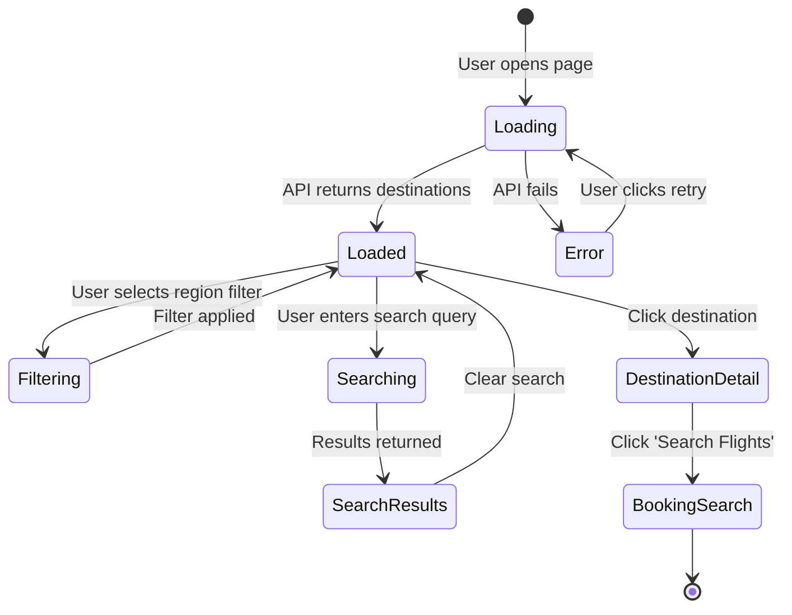
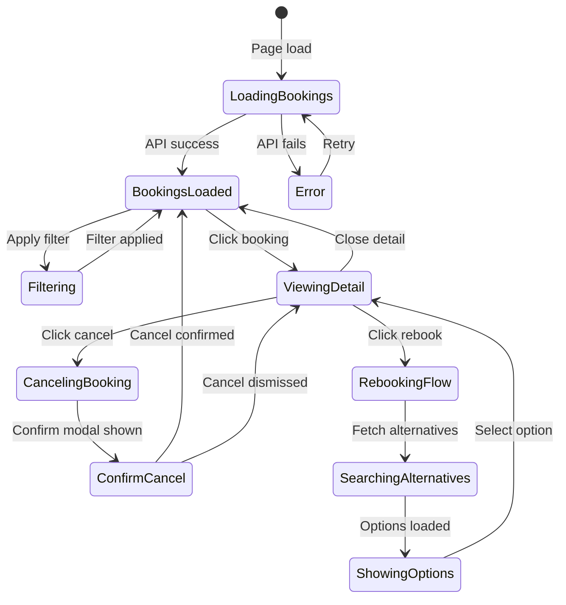
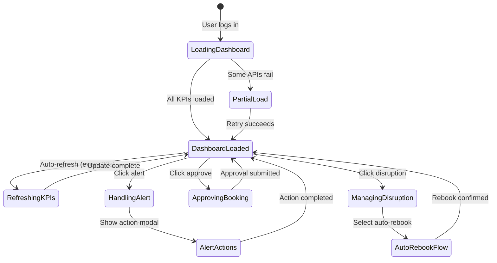
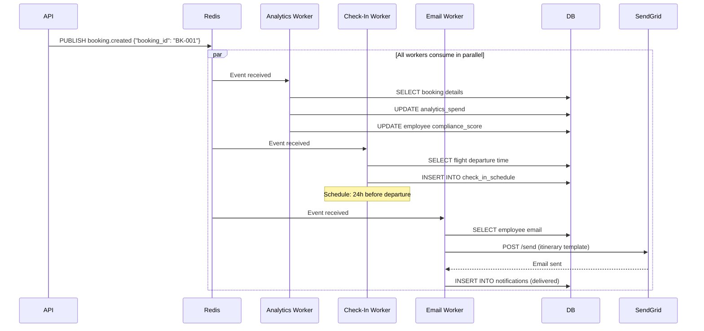

# Complete Data Flow & UI State Documentation

## Overview

This document shows exactly how data flows through the system from **user interaction** → **API calls** → **database updates** → **UI state changes** → **background jobs**.

---

## 1. Booking Flow - Complete Data Journey

### Step-by-Step Data Transformation

```mermaid
graph TD
    A[User opens Explore page] -->|GET /destinations| B[API queries PostgreSQL]
    B --> C[Returns destinations JSON]
    C --> D[Frontend: Update Zustand store]
    D --> E[Render destinations list]
    
    E --> F[User clicks 'London']
    F -->|POST /bookings/search| G[API Gateway]
    
    G --> H1[Parallel: Query Duffel API]
    G --> H2[Parallel: Query Hotelbeds API]
    G --> H3[Parallel: Query Weather API]
    
    H1 --> I[Aggregate results]
    H2 --> I
    H3 --> I
    
    I -->|POST /policies/bulk-evaluate| J[Policy Engine]
    J -->|SELECT policies FROM DB| K[PostgreSQL]
    K --> L[Return tagged options]
    
    L --> M[Frontend: Update search results state]
    M --> N[Render flight/hotel cards with policy badges]
    
    N --> O[User selects: Economy flight + Hilton]
    O -->|POST /bookings/draft| P[API Gateway]
    
    P --> Q[BEGIN TRANSACTION]
    Q --> R[INSERT INTO bookings]
    R --> S[INSERT INTO booking_segments x2]
    S --> T[COMMIT TRANSACTION]
    
    T -->|POST /policies/evaluate| U[Policy Engine]
    U --> V[Return: OK]
    
    V --> W[Frontend: Show draft summary]
    W --> X[User clicks 'Confirm']
    
    X -->|POST /bookings/confirm| Y[API Gateway]
    Y -->|Final policy check| Z[Policy Engine]
    
    Z --> AA{Approval<br/>Required?}
    
    AA -->|Yes| AB[Create approval workflow]
    AB --> AC[INSERT INTO approval_workflows]
    AC --> AD[Send notification to manager]
    AD --> AE[Frontend: Show 'Pending Approval' state]
    
    AA -->|No| AF[Create virtual card]
    AF -->|POST /issuing/cards| AG[Stripe API]
    AG --> AH[Return card details]
    AH --> AI[INSERT INTO virtual_cards]
    
    AI --> AJ[Book flight: POST to Duffel]
    AJ --> AK[Book hotel: POST to Hotelbeds]
    AK --> AL[UPDATE booking status='confirmed']
    
    AL --> AM[PUBLISH booking.created event to Redis]
    AM --> AN1[Worker 1: Update analytics]
    AM --> AN2[Worker 2: Schedule check-in]
    AM --> AN3[Worker 3: Send email]
    
    AN1 --> AO[Frontend: Refresh bookings list]
    AN3 --> AP[User receives confirmation email]
```



---

## 2. UI State Flow - Detailed Transitions

### Explore Page State Machine



**State Structure:**
```typescript
// stores/exploreStore.ts
interface ExploreState {
  view: 'destinations' | 'routes' | 'events' | 'suppliers';
  
  destinations: Destination[];
  loading: boolean;
  error: string | null;
  
  filters: {
    region: 'all' | 'europe' | 'asia_pacific' | 'north_america' | 'middle_east' | 'latin_america';
    riskLevel: 'all' | 'low' | 'medium' | 'high';
    sortBy: 'trips_count' | 'savings' | 'alphabetical';
  };
  
  searchQuery: string;
  
  selectedDestination: Destination | null;
}

// Actions
const useExploreStore = create<ExploreState>((set) => ({
  destinations: [],
  loading: false,
  error: null,
  filters: { region: 'all', riskLevel: 'all', sortBy: 'trips_count' },
  searchQuery: '',
  selectedDestination: null,
  
  fetchDestinations: async () => {
    set({ loading: true });
    const data = await api.get('/destinations');
    set({ destinations: data, loading: false });
  },
  
  setFilter: (key, value) => {
    set((state) => ({
      filters: { ...state.filters, [key]: value }
    }));
  },
  
  selectDestination: (dest) => {
    set({ selectedDestination: dest });
  }
}));
```

---

### Bookings List State Machine



**State Structure:**
```typescript
// stores/bookingsStore.ts
interface BookingsState {
  bookings: Booking[];
  kpis: {
    totalBookings: number;
    activeThisMonth: number;
    confirmed: number;
    readyToTravel: number;
    activeAlerts: number;
    requireAttention: number;
    totalValueThisMonth: number;
  };
  
  filters: {
    status: 'all' | 'confirmed' | 'pending_approval' | 'disruptions' | 'non_compliant';
    search: string;
    dateRange: [Date, Date] | null;
    employees: number[];
    departments: string[];
  };
  
  selectedBooking: Booking | null;
  detailView: boolean;
  
  rebookFlow: {
    active: boolean;
    bookingId: string | null;
    alternatives: FlightOption[];
    selectedAlternative: FlightOption | null;
  };
  
  loading: boolean;
  error: string | null;
}

// Example booking object
interface Booking {
  id: string;
  employee: {
    id: number;
    name: string;
    avatar: string;
  };
  destination: string;
  dates: {
    start: string;
    end: string;
    formatted: string;
  };
  status: 'draft' | 'pending_approval' | 'confirmed' | 'in_progress' | 'completed' | 'canceled';
  policyStatus: 'compliant' | 'soft_warning' | 'non_compliant';
  amount: number;
  segments: Segment[];
  disruptions: Disruption[];
  payment: {
    po?: string;
    cc_last4?: string;
    gl_code: string;
  };
  invoiceStatus: 'pending' | 'sent' | 'reconciled' | 'disputed';
  credits: number | null;
}
```

---

### Dashboard State Machine



**State Structure:**
```typescript
// stores/dashboardStore.ts
interface DashboardState {
  criticalAlerts: {
    count: number;
    items: Alert[];
  };
  
  disruptionManagement: {
    activeIncidents: number;
    incidents: Incident[];
  };
  
  pendingApprovals: {
    count: number;
    urgent: number;
    items: Approval[];
  };
  
  budgetDashboard: {
    totalBudget: number;
    spent: number;
    remaining: number;
    utilization: number;
    burnRate: number;
    trend: 'up' | 'down';
    departmentSpend: {
      department: string;
      amount: number;
    }[];
  };
  
  travelerStatus: {
    departingToday: number;
    currentlyTraveling: number;
    inAir: number;
    atDestination: number;
    returningThisWeek: number;
  };
  
  savingsOpportunities: {
    total: number;
    items: Opportunity[];
  };
  
  autoRefreshEnabled: boolean;
  lastRefresh: Date;
  
  loading: Record<string, boolean>; // Track loading per section
  errors: Record<string, string>;
}

// Auto-refresh logic
useEffect(() => {
  if (!autoRefreshEnabled) return;
  
  const interval = setInterval(() => {
    refreshKPIs();
  }, 30000); // 30 seconds
  
  return () => clearInterval(interval);
}, [autoRefreshEnabled]);
```

---

## 3. API Request/Response Flow

### Search Bookings - Complete Payload Flow

**Frontend Request:**
```typescript
// API call
const searchBookings = async (params: SearchParams) => {
  const response = await fetch('/api/bookings/search', {
    method: 'POST',
    headers: {
      'Content-Type': 'application/json',
      'Authorization': `Bearer ${token}`
    },
    body: JSON.stringify({
      employee_id: 42,
      origin: 'JFK',
      destination: 'LHR',
      depart_date: '2025-10-18',
      return_date: '2025-10-22',
      passengers: 1,
      preferences: {
        cabin_class: 'Economy',
        max_stops: 1
      }
    })
  });
  
  return response.json();
};
```

**Backend Processing:**
```python
# app/api/bookings.py
@router.post("/search")
async def search_bookings(
    request: SearchRequest,
    current_user: User = Depends(get_current_user)
):
    # 1. Validate request
    validate_search_params(request)
    
    # 2. Parallel API calls
    async with httpx.AsyncClient() as client:
        flights_task = search_flights(client, request)
        hotels_task = search_hotels(client, request)
        weather_task = get_weather(client, request.destination)
        
        flights, hotels, weather = await asyncio.gather(
            flights_task, 
            hotels_task, 
            weather_task
        )
    
    # 3. Policy evaluation
    policy_results = await policy_engine.bulk_evaluate(
        employee_id=request.employee_id,
        options=flights + hotels
    )
    
    # 4. Merge policy results
    tagged_flights = merge_policy_tags(flights, policy_results)
    tagged_hotels = merge_policy_tags(hotels, policy_results)
    
    # 5. Return response
    return SearchResponse(
        search_id=uuid4(),
        flights=tagged_flights,
        hotels=tagged_hotels,
        weather=weather
    )
```

**Response:**
```json
{
  "search_id": "SRCH-abc123",
  "flights": [
    {
      "offer_id": "FL-001",
      "provider": "Duffel",
      "airline": "BA",
      "flight_number": "BA178",
      "departure": "2025-10-18T18:00:00Z",
      "arrival": "2025-10-19T06:20:00Z",
      "duration_mins": 440,
      "fare_class": "Economy",
      "cabin_class": "Economy",
      "price": 1850,
      "currency": "USD",
      "policy_status": "OK",
      "policy_badges": ["✅ Compliant", "⭐ Preferred vendor"],
      "co2_kg": 450,
      "stops": 0,
      "baggage": {
        "carry_on": "1 x 23kg",
        "checked": "1 x 23kg"
      }
    },
    {
      "offer_id": "FL-002",
      "provider": "Amadeus",
      "airline": "UA",
      "flight_number": "UA15",
      "departure": "2025-10-18T16:30:00Z",
      "arrival": "2025-10-19T08:45:00Z",
      "duration_mins": 495,
      "fare_class": "Economy",
      "cabin_class": "Economy",
      "price": 1920,
      "currency": "USD",
      "policy_status": "OK",
      "policy_badges": ["✅ Compliant"],
      "co2_kg": 480,
      "stops": 1,
      "layover": "ORD (2h 15m)"
    },
    {
      "offer_id": "FL-003",
      "provider": "Duffel",
      "airline": "BA",
      "flight_number": "BA178",
      "departure": "2025-10-18T18:00:00Z",
      "arrival": "2025-10-19T06:20:00Z",
      "duration_mins": 440,
      "fare_class": "Business",
      "cabin_class": "Business",
      "price": 3200,
      "currency": "USD",
      "policy_status": "SOFT_WARNING",
      "policy_badges": ["⚠️ Requires approval"],
      "policy_warning": "Business class requires VP approval for flights under 6 hours",
      "co2_kg": 820
    }
  ],
  "hotels": [
    {
      "offer_id": "HT-001",
      "provider": "Hotelbeds",
      "name": "Hilton London Metropole",
      "address": "225 Edgware Road, London",
      "rating": 4.5,
      "checkin": "2025-10-18",
      "checkout": "2025-10-22",
      "nights": 4,
      "room_type": "Standard Double",
      "price_per_night": 245,
      "total_price": 980,
      "currency": "USD",
      "policy_status": "OK",
      "policy_badges": ["✅ Compliant", "⭐ Preferred vendor"],
      "amenities": ["WiFi", "Breakfast", "Gym"],
      "cancellation_policy": "Free until 48h before"
    },
    {
      "offer_id": "HT-002",
      "provider": "Expedia",
      "name": "Marriott West India Quay",
      "address": "22 Hertsmere Road, London",
      "rating": 4.3,
      "checkin": "2025-10-18",
      "checkout": "2025-10-22",
      "nights": 4,
      "room_type": "King Room",
      "price_per_night": 280,
      "total_price": 1120,
      "currency": "USD",
      "policy_status": "OK",
      "policy_badges": ["✅ Compliant"],
      "amenities": ["WiFi", "Pool", "Gym"],
      "cancellation_policy": "Free until 24h before"
    }
  ],
  "weather": {
    "destination": "London",
    "forecast": "Light rain expected Oct 19-20",
    "severity": "low",
    "temperature_avg": 15,
    "precipitation_chance": 60
  }
}
```

**Frontend State Update:**
```typescript
// After API response
const handleSearchResults = (response: SearchResponse) => {
  // Update Zustand store
  useBookingStore.setState({
    searchResults: {
      searchId: response.search_id,
      flights: response.flights.map(flight => ({
        ...flight,
        // Add UI-specific fields
        isSelected: false,
        isExpanded: false
      })),
      hotels: response.hotels.map(hotel => ({
        ...hotel,
        isSelected: false,
        isExpanded: false
      })),
      weather: response.weather
    },
    loading: false
  });
  
  // Navigate to results page
  router.push('/bookings/search-results');
};
```

---

## 4. Database Transaction Flow

### Booking Confirmation - Complete DB Operations

```sql
-- Step 1: Begin transaction
BEGIN;

-- Step 2: Insert booking record
INSERT INTO bookings (
    id, org_id, employee_id, status, total_amount, 
    currency, policy_status, trip_purpose, idempotency_key, created_at
) VALUES (
    'BK-2024-1847', 
    'org-abc', 
    42, 
    'draft', 
    2830, 
    'USD', 
    'ok', 
    'Client meeting', 
    'uuid-1234', 
    NOW()
) RETURNING id;

-- Step 3: Insert flight segment
INSERT INTO booking_segments (
    id, booking_id, segment_type, provider, from_city, 
    to_city, depart_at, arrive_at, fare_class, cabin_class, 
    airline_code, flight_number, price, currency, details
) VALUES (
    gen_random_uuid(), 
    'BK-2024-1847', 
    'flight', 
    'Duffel', 
    'JFK', 
    'LHR', 
    '2025-10-18 18:00:00+00', 
    '2025-10-19 06:20:00+00', 
    'Economy', 
    'Economy', 
    'BA', 
    'BA178', 
    1850, 
    'USD', 
    '{"offer_id": "FL-001", ...}'::jsonb
);

-- Step 4: Insert hotel segment
INSERT INTO booking_segments (
    id, booking_id, segment_type, provider, hotel_name, 
    room_type, checkin_date, checkout_date, nights, 
    price, currency, details
) VALUES (
    gen_random_uuid(), 
    'BK-2024-1847', 
    'hotel', 
    'Hotelbeds', 
    'Hilton London Metropole', 
    'Standard Double', 
    '2025-10-18', 
    '2025-10-22', 
    4, 
    980, 
    'USD', 
    '{"offer_id": "HT-001", ...}'::jsonb
);

-- Step 5: Insert policy evaluation record
INSERT INTO policy_evaluations (
    id, booking_id, policy_id, result, details, evaluated_at
) VALUES (
    gen_random_uuid(), 
    'BK-2024-1847', 
    'POL-001', 
    'PASS', 
    '{"rule": "advance_booking", "threshold_days": 7, "actual_days": 14}'::jsonb, 
    NOW()
);

-- Step 6: Commit transaction
COMMIT;
-- If any step fails, automatic ROLLBACK
```

**On Confirmation (later):**
```sql
BEGIN;

-- Update booking status
UPDATE bookings 
SET status = 'confirmed', 
    confirmed_at = NOW(), 
    updated_at = NOW()
WHERE id = 'BK-2024-1847';

-- Insert virtual card
INSERT INTO virtual_cards (
    id, booking_id, org_id, provider_card_id, 
    card_number_last4, limit_amount, status, created_at
) VALUES (
    gen_random_uuid(), 
    'BK-2024-1847', 
    'org-abc', 
    'stripe_card_123', 
    '4242', 
    2830, 
    'active', 
    NOW()
);

-- Update segments with supplier refs (after external booking)
UPDATE booking_segments 
SET supplier_ref = 'BA178ABC', 
    updated_at = NOW()
WHERE booking_id = 'BK-2024-1847' 
  AND segment_type = 'flight';

UPDATE booking_segments 
SET supplier_ref = 'HLT-456', 
    updated_at = NOW()
WHERE booking_id = 'BK-2024-1847' 
  AND segment_type = 'hotel';

COMMIT;

-- Publish event (outside transaction)
PUBLISH booking_events '{"event":"booking.created", "booking_id":"BK-2024-1847"}'
```

---

## 5. Event Flow - Asynchronous Processing

### booking.created Event Cascade



**Worker Implementation:**
```python
# workers/analytics_worker.py
@celery.task
def handle_booking_created(event_data):
    booking_id = event_data['booking_id']
    
    # Fetch booking details
    booking = db.bookings.get(booking_id)
    employee = db.employees.get(booking.employee_id)
    
    # Update spend aggregation
    db.analytics_spend.insert_or_update({
        'org_id': booking.org_id,
        'period_type': 'monthly',
        'period_start': date.today().replace(day=1),
        'period_end': (date.today().replace(day=1) + timedelta(days=32)).replace(day=1),
        'department': employee.department,
        'total_bookings': db.raw('total_bookings + 1'),
        'total_spend': db.raw(f'total_spend + {booking.total_amount}')
    })
    
    # Calculate CO2
    flight_segments = [s for s in booking.segments if s.segment_type == 'flight']
    co2_total = sum(calculate_co2(seg) for seg in flight_segments)
    
    db.analytics_spend.update_where(
        {'period_start': date.today().replace(day=1)},
        {'co2_emissions': db.raw(f'co2_emissions + {co2_total}')}
    )
    
    # Update employee compliance score
    if booking.policy_status == 'ok':
        db.employees.update(
            employee.id,
            {'compliance_score': min(100, employee.compliance_score + 0.5)}
        )
```

---

## 6. Frontend Component Hierarchy

### Bookings Page Component Tree

```
BookingsPage (Page)
├─ PageHeader
│  ├─ Title ("Bookings & Operations")
│  ├─ ActionButtons
│  │  ├─ ExportButton
│  │  └─ NewBookingButton
│  └─ KPICards
│     ├─ TotalBookingsCard (10)
│     ├─ CriticalAlertsCard (0)
│     ├─ DisruptionsCard (5)
│     ├─ PendingInvoicesCard (3)
│     └─ TotalValueCard ($13,255)
│
├─ FilterTabs
│  ├─ AllBookingsTab (5) [active]
│  ├─ ConfirmedTab (3)
│  ├─ PendingApprovalTab (1)
│  ├─ DisruptionAlertsTab (5)
│  └─ WithCreditsTab
│
├─ AdvancedFilters (collapsible)
│  ├─ SearchInput
│  ├─ DateRangePicker
│  ├─ EmployeeMultiSelect
│  └─ DepartmentMultiSelect
│
├─ BookingsList
│  ├─ BookingCard (Michael Chen - London)
│  │  ├─ Header
│  │  │  ├─ EmployeeAvatar ("MC")
│  │  │  ├─ EmployeeName
│  │  │  ├─ Destination
│  │  │  └─ BookingID
│  │  ├─ TravelDates
│  │  ├─ StatusBadges
│  │  │  ├─ ConfirmedBadge
│  │  │  └─ PolicyCompliantBadge
│  │  ├─ AmountDisplay ($2,450)
│  │  ├─ DisruptionAlert
│  │  │  ├─ AlertIcon
│  │  │  ├─ AlertMessage
│  │  │  └─ ActionButtons (Rebook, Notify)
│  │  ├─ SegmentsList
│  │  │  ├─ FlightSegment
│  │  │  │  ├─ FlightIcon
│  │  │  │  ├─ FlightNumber ("BA 178")
│  │  │  │  └─ Class ("Business")
│  │  │  └─ HotelSegment
│  │  │     ├─ HotelIcon
│  │  │     └─ HotelName
│  │  ├─ PaymentInfo
│  │  │  ├─ PONumber
│  │  │  ├─ CardLast4
│  │  │  └─ GLCode
│  │  └─ Footer
│  │     ├─ InvoiceStatus
│  │     ├─ CreditsDisplay
│  │     └─ ViewDetailsButton
│  │
│  ├─ BookingCard (Sarah Johnson - Singapore)
│  ├─ BookingCard (David Park - Paris)
│  └─ ...
│
└─ Pagination
   ├─ PageNumbers
   ├─ PrevButton
   └─ NextButton
```

**Component Code:**
```typescript
// components/BookingCard.tsx
interface BookingCardProps {
  booking: Booking;
  onViewDetails: (id: string) => void;
  onRebook: (id: string) => void;
  onCancel: (id: string) => void;
}

export const BookingCard: React.FC<BookingCardProps> = ({
  booking,
  onViewDetails,
  onRebook,
  onCancel
}) => {
  return (
    <div className="booking-card">
      {/* Header */}
      <div className="booking-header">
        <Avatar initials={booking.employee.avatar} />
        <div className="booking-info">
          <h3>{booking.employee.name}</h3>
          <p className="destination">{booking.destination}</p>
          <span className="booking-id">{booking.id}</span>
        </div>
        <div className="booking-meta">
          <span className="dates">{booking.dates.formatted}</span>
          <span className="booked-by">
            Booked by {booking.bookedBy || 'Self'}
          </span>
        </div>
      </div>
      
      {/* Status Badges */}
      <div className="status-badges">
        <Badge 
          variant={booking.status === 'confirmed' ? 'success' : 'warning'}
          text={booking.status}
        />
        <Badge 
          variant={booking.policyStatus === 'compliant' ? 'success' : 'error'}
          text={booking.policyStatus}
        />
      </div>
      
      {/* Amount */}
      <div className="amount">
        ${booking.amount.toLocaleString()}
      </div>
      
      {/* Disruptions */}
      {booking.disruptions.map(disruption => (
        <DisruptionAlert 
          key={disruption.id}
          severity={disruption.severity}
          message={disruption.message}
          autoRebookEnabled={disruption.autoRebookEnabled}
          onRebook={() => onRebook(booking.id)}
        />
      ))}
      
      {/* Segments */}
      <div className="segments">
        {booking.segments.map(segment => (
          <SegmentDisplay key={segment.id} segment={segment} />
        ))}
      </div>
      
      {/* Payment */}
      <div className="payment-info">
        {booking.payment.po && <span>PO: {booking.payment.po}</span>}
        {booking.payment.cc_last4 && <span>CC: •••• {booking.payment.cc_last4}</span>}
        <span>GL: {booking.payment.gl_code}</span>
      </div>
      
      {/* Footer */}
      <div className="booking-footer">
        <InvoiceStatus status={booking.invoiceStatus} />
        {booking.credits && <span>${booking.credits} credits</span>}
        <button onClick={() => onViewDetails(booking.id)}>
          View Details
        </button>
      </div>
    </div>
  );
};
```

---

## 7. Real-time Updates - WebSocket/Polling

### Dashboard Auto-Refresh

```typescript
// hooks/useDashboardRefresh.ts
import { useEffect } from 'react';
import { useDashboardStore } from '@/stores/dashboardStore';

export const useDashboardRefresh = (intervalMs: number = 30000) => {
  const refreshKPIs = useDashboardStore(state => state.refreshKPIs);
  const autoRefreshEnabled = useDashboardStore(state => state.autoRefreshEnabled);
  
  useEffect(() => {
    if (!autoRefreshEnabled) return;
    
    // Initial fetch
    refreshKPIs();
    
    // Setup interval
    const interval = setInterval(() => {
      refreshKPIs();
    }, intervalMs);
    
    // Cleanup
    return () => clearInterval(interval);
  }, [autoRefreshEnabled, intervalMs, refreshKPIs]);
};

// Usage in Dashboard component
const Dashboard = () => {
  useDashboardRefresh(30000); // Refresh every 30s
  
  const kpis = useDashboardStore(state => state.kpis);
  const lastRefresh = useDashboardStore(state => state.lastRefresh);
  
  return (
    <div>
      <RefreshIndicator lastRefresh={lastRefresh} />
      <KPICards data={kpis} />
    </div>
  );
};
```

**Alternative: WebSocket (for real-time alerts)**
```typescript
// hooks/useWebSocket.ts
import { useEffect } from 'react';
import { useDashboardStore } from '@/stores/dashboardStore';

export const useWebSocket = () => {
  useEffect(() => {
    const ws = new WebSocket('wss://api.example.com/ws');
    
    ws.onopen = () => {
      console.log('WebSocket connected');
      // Subscribe to channels
      ws.send(JSON.stringify({
        action: 'subscribe',
        channels: ['disruptions', 'approvals', 'bookings']
      }));
    };
    
    ws.onmessage = (event) => {
      const message = JSON.parse(event.data);
      
      switch (message.type) {
        case 'disruption.detected':
          useDashboardStore.getState().addDisruption(message.data);
          // Show toast notification
          toast.error(`Disruption: ${message.data.message}`);
          break;
          
        case 'booking.confirmed':
          useDashboardStore.getState().updateBooking(message.data);
          toast.success('Booking confirmed');
          break;
          
        case 'approval.required':
          useDashboardStore.getState().addPendingApproval(message.data);
          toast.info('New approval request');
          break;
      }
    };
    
    ws.onerror = (error) => {
      console.error('WebSocket error:', error);
    };
    
    ws.onclose = () => {
      console.log('WebSocket disconnected');
      // Attempt reconnect after 5s
      setTimeout(() => {
        // Re-establish connection
      }, 5000);
    };
    
    return () => {
      ws.close();
    };
  }, []);
};
```

---

## Summary: Complete Data Flow

```
User Action (UI)
     ↓
Frontend State Update (Zustand)
     ↓
API Request (React Query)
     ↓
API Gateway (FastAPI)
     ↓
Service Layer (Booking/Policy/Payment Service)
     ↓
External APIs (Duffel, Stripe, etc.)
     ↓
Database Transaction (PostgreSQL)
     ↓
Event Published (Redis PubSub)
     ↓
Background Workers (Celery)
     ↓
Database Updates (Analytics, Notifications)
     ↓
WebSocket/Polling (Real-time updates)
     ↓
Frontend State Update
     ↓
UI Re-render
```

This complete documentation shows **every step** of how data flows through your platform! 🚀
