# Detailed Sequence Diagrams

## 1. Complete Booking Flow (Happy Path)

---

## 2. Booking with Approval Flow

```mermaid
sequenceDiagram
    autonumber
    participant U as Employee
    participant FE as Frontend
    participant API as API
    participant Policy as Policy Engine
    participant Approval as Approval Service
    participant Notif as Notification
    participant Mgr as Manager
    participant DB as Database
    
    %% User submits booking
    rect rgb(255, 240, 240)
        Note over U,DB: PHASE 1: POLICY VIOLATION DETECTED
        U->>FE: Confirms booking (Business class, 3hr flight)
        FE->>API: POST /bookings/{id}/confirm
        
        API->>Policy: POST /policies/evaluate (final)
        Policy->>DB: SELECT policies WHERE type='soft'
        Policy->>Policy: Check: Business class + duration < 6h
        Policy-->>API: SOFT_WARNING (requires VP approval)
        
        API->>Approval: create_workflow(booking_id, policy_result)
        Approval->>DB: INSERT INTO approval_workflows
        Approval->>DB: Determine approvers (manager → VP)
        
        Approval->>DB: UPDATE bookings SET status='pending_approval'
        Approval-->>API: {workflow_id, approvers, sla}
        
        API-->>FE: 202 Accepted {status: "pending_approval"}
        FE->>U: "Your booking requires manager approval"
    end
    
    %% Notification
    rect rgb(240, 245, 255)
        Note over U,DB: PHASE 2: APPROVAL NOTIFICATION
        Approval->>Notif: notify_approver(manager_id, booking_details)
        Notif->>Mgr: Email: "Approve booking for Employee X"
        Notif->>Mgr: Slack: "New approval request"
    end
    
    %% Manager approves
    rect rgb(240, 255, 240)
        Note over U,DB: PHASE 3: APPROVAL DECISION
        Mgr->>FE: Opens approval link
        Mgr->>FE: Reviews booking details + policy warning
        Mgr->>FE: Clicks "Approve" with justification
        
        FE->>API: POST /approvals/{id}/approve {justification}
        API->>DB: UPDATE approval_workflows SET status='approved'
        API->>DB: UPDATE bookings SET status='confirmed'
        
        %% Trigger booking execution
        API->>API: trigger_booking_execution(booking_id)
        Note over API,DB: (Same flow as happy path booking)
        
        API->>Notif: notify_employee(booking_approved)
        Notif->>U: Email: "Your booking has been approved and confirmed"
        
        API-->>FE: {status: "approved"}
        FE->>Mgr: "Booking approved successfully"
    end
```

---

## 3. Disruption Detection & Auto-Rebook

---

## 4. Payment Reconciliation Flow

---

## 5. Multi-Step Approval Workflow

```mermaid
sequenceDiagram
    autonumber
    participant Emp as Employee
    participant API as API
    participant Approval as Approval Engine
    participant DB as Database
    participant Notif as Notification
    participant Mgr as Manager
    participant VP as VP Finance
    participant Exec as Executive
    
    %% Booking requires multi-step approval
    rect rgb(255, 250, 240)
        Note over Emp,Exec: HIGH-VALUE BOOKING ($15,000)
        Emp->>API: POST /bookings/confirm (Tokyo trip, $15K)
        API->>Approval: evaluate_approval_requirements
        
        Approval->>DB: SELECT approval_policies
        Note right of Approval: Thresholds:<br/>$5K → Manager<br/>$10K → VP Finance<br/>$15K → Executive
        
        Approval->>DB: INSERT INTO approval_workflows
        Note right of Approval: {\n  steps: [\n    {step: 1, approver: Manager, threshold: 5K},\n    {step: 2, approver: VP Finance, threshold: 10K},\n    {step: 3, approver: Executive, threshold: 15K}\n  ]\n}
        
        Approval-->>API: Workflow created (3 steps)
        API-->>Emp: "Booking pending 3-level approval"
    end
    
    %% Step 1: Manager
    rect rgb(240, 250, 255)
        Note over Emp,Exec: STEP 1: MANAGER APPROVAL
        Approval->>Notif: notify_approver(Manager)
        Notif->>Mgr: Email + Slack notification
        
        Mgr->>API: POST /approvals/{id}/approve (Step 1)
        API->>DB: UPDATE approval_workflows SET current_step=2
        
        Approval->>Notif: notify_approver(VP Finance)
        Notif->>VP: Email: "Pending your approval (Step 2 of 3)"
    end
    
    %% Step 2: VP Finance
    rect rgb(240, 255, 250)
        Note over Emp,Exec: STEP 2: VP FINANCE APPROVAL
        VP->>API: Reviews budget utilization
        VP->>API: POST /approvals/{id}/approve (Step 2)
        API->>DB: UPDATE approval_workflows SET current_step=3
        
        Approval->>Notif: notify_approver(Executive)
        Notif->>Exec: Email: "Final approval required (Step 3 of 3)"
    end
    
    %% Step 3: Executive (with SLA escalation)
    rect rgb(255, 245, 250)
        Note over Emp,Exec: STEP 3: EXECUTIVE APPROVAL + SLA
        
        loop SLA Check (every 6 hours)
            Approval->>DB: SELECT WHERE sla_deadline < NOW()
            alt SLA breached
                Approval->>Notif: escalate_approval(COO)
                Notif->>Exec: "URGENT: Approval overdue"
            end
        end
        
        Exec->>API: POST /approvals/{id}/approve (Step 3)
        API->>DB: UPDATE approval_workflows SET status='approved'
        API->>DB: UPDATE bookings SET status='confirmed'
        
        %% Trigger booking execution
        API->>API: execute_booking(booking_id)
        
        Approval->>Notif: notify_all_stakeholders
        Notif->>Emp: "Booking approved and confirmed"
        Notif->>Mgr: "Booking completed"
        Notif->>VP: "Booking completed"
    end
```

---

## 6. AI Concierge Conversation Flow

```mermaid
sequenceDiagram
    autonumber
    participant User as User
    participant Chat as Chat UI
    participant API as API
    participant LLM as OpenAI GPT-4
    participant Tools as Function Tools
    participant Booking as Booking Service
    participant Policy as Policy Engine
    participant DB as Database
    
    %% User starts conversation
    rect rgb(245, 250, 255)
        Note over User,DB: PHASE 1: INTENT RECOGNITION
        User->>Chat: "Book a flight to London next week"
        Chat->>API: POST /ai-concierge/chat
        
        API->>LLM: Prompt + user message + context
        Note right of API: System: You are a corporate travel assistant.<br/>Tools: search_flights, check_policy, create_booking
        
        LLM->>LLM: Parse intent: BOOK_FLIGHT
        LLM-->>API: Function call: search_flights(dest="London", dates="next week")
    end
    
    %% Execute tool
    rect rgb(250, 255, 245)
        Note over User,DB: PHASE 2: SEARCH EXECUTION
        API->>Tools: execute_function(search_flights)
        Tools->>Booking: POST /bookings/search (flexible dates)
        Booking-->>Tools: 20 flight options
        
        Tools->>Policy: POST /policies/bulk-evaluate (top 5 options)
        Policy-->>Tools: Tagged options (3 green, 2 amber)
        
        Tools-->>API: Filtered results (policy-compliant first)
    end
    
    %% LLM generates response
    rect rgb(255, 250, 245)
        Note over User,DB: PHASE 3: INTELLIGENT RESPONSE
        API->>LLM: Function response + filtered results
        LLM->>LLM: Generate natural language response
        LLM-->>API: "I found 3 policy-compliant flights to London:<br/><br/>1. BA178 - $1,850 (Economy, direct)<br/>2. UA15 - $1,920 (Economy, 1 stop)<br/>3. AA101 - $3,200 (Business)<br/><br/>Option 1 is recommended (lowest cost + direct).<br/>Would you like to proceed with BA178?"
        
        API-->>Chat: Stream response
        Chat->>User: Display formatted message + action buttons
    end
    
    %% User confirms
    rect rgb(250, 245, 255)
        Note over User,DB: PHASE 4: BOOKING CONFIRMATION
        User->>Chat: "Yes, book BA178"
        Chat->>API: POST /ai-concierge/chat (continue conversation)
        
        API->>LLM: User confirmation message
        LLM-->>API: Function call: create_booking(flight="BA178")
        
        API->>Tools: execute_function(create_booking)
        Tools->>DB: INSERT INTO bookings (status='draft')
        Tools->>Policy: evaluate_booking (final check)
        Policy-->>Tools: OK (no approval needed)
        
        Tools-->>API: {booking_id, status: "draft"}
        
        API->>LLM: Booking created successfully
        LLM-->>API: "Great! I've created your booking:<br/><br/>✅ BA178 - London<br/>📅 Oct 18, 6:00 PM<br/>💵 $1,850<br/><br/>Ready to confirm? I'll also search for hotels."
        
        API-->>Chat: Stream response
        Chat->>User: Display booking summary + confirm button
    end
    
    %% Context-aware follow-up
    rect rgb(255, 250, 250)
        Note over User,DB: PHASE 5: CONTEXTUAL HOTEL SEARCH
        LLM->>LLM: Proactive action: search_hotels
        Note right of LLM: Context: User booked LHR flight Oct 18-22
        
        LLM-->>API: Function call: search_hotels(city="London", checkin="Oct 18", checkout="Oct 22")
        API->>Tools: execute_function
        Tools->>Booking: POST /hotels/search
        Booking-->>Tools: 15 hotel options
        
        Tools-->>API: Filtered results (preferred vendors first)
        API->>LLM: Hotel results
        
        LLM-->>Chat: "I also found 3 preferred hotels:<br/><br/>1. Hilton Metropole - $245/night ⭐ Best value<br/>2. Marriott West India Quay - $280/night<br/>3. Hyatt Regency - $320/night<br/><br/>All are within policy. Which do you prefer?"
    end
```

---

## 7. Analytics Aggregation (Background Job)

---

## Key Takeaways from Sequence Diagrams:

### 1. **Idempotency is Critical**
- Every booking operation uses `idempotency_key`
- Prevents duplicate bookings on retries

### 2. **Async Operations**
- Heavy tasks (analytics, notifications) happen asynchronously
- Main booking flow stays fast (<2s response time)

### 3. **Policy Engine is Central**
- Called at multiple stages: search, draft, confirm, rebook
- Ensures compliance throughout lifecycle

### 4. **Multi-Layer Communication**
- Frontend → API Gateway → Services → External APIs
- Clear separation of concerns

### 5. **Event-Driven Architecture**
- BookingCreated event triggers: analytics, check-in, reconciliation
- Decouples services

### 6. **Resilience Patterns**
- Retries with exponential backoff
- Circuit breakers for external APIs
- Fallback to manual workflows

---

## Error Handling Patterns

This comprehensive set of diagrams shows **exactly how data flows** through your system for every major user journey!
