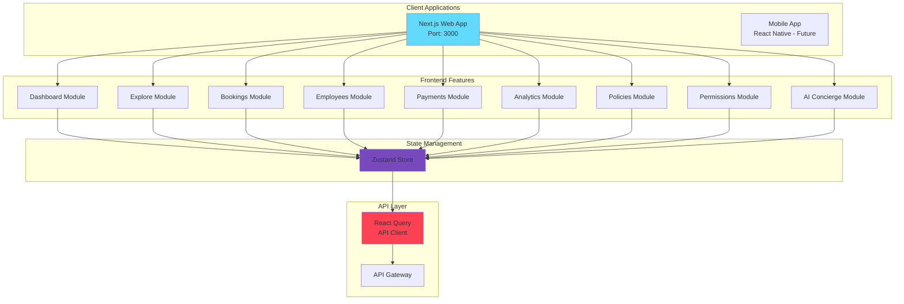
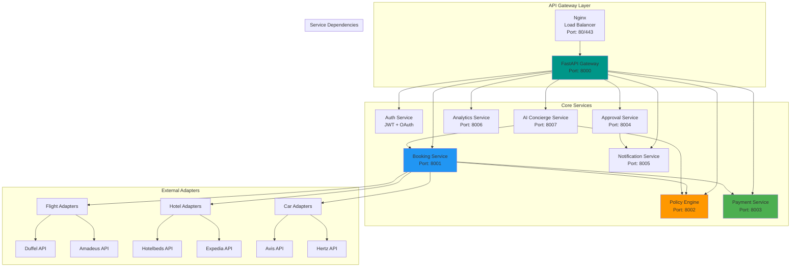
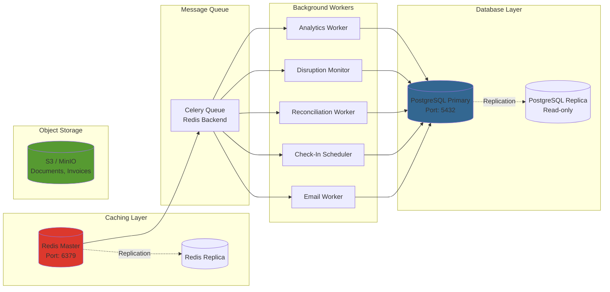

# Service Architecture & Implementation Checklist

## System Components Breakdown

### Frontend Services



---

### Backend Services



---

### Data & Infrastructure Layer



---

## Service Details & Responsibilities

### 1. **Booking Service**

**Port:** 8001  
**Language:** Python (FastAPI)  
**Database:** PostgreSQL

**Responsibilities:**
- Search aggregation (flights, hotels, cars)
- Supplier adapter pattern
- Booking lifecycle management (draft → confirmed → completed)
- Idempotency handling
- Retry logic & circuit breakers
- Supplier webhook handling

**Key Endpoints:**
```
POST   /bookings/search
POST   /bookings/draft
POST   /bookings/{id}/confirm
GET    /bookings
GET    /bookings/{id}
PATCH  /bookings/{id}/cancel
POST   /bookings/{id}/rebook
```

**Adapters:**
```python
# adapters/flights/duffel_adapter.py
class DuffelAdapter(FlightAdapter):
    def search(self, params) -> List[FlightOffer]
    def book(self, offer_id, payment) -> BookingConfirmation
    def cancel(self, booking_ref) -> CancellationResult

# adapters/flights/amadeus_adapter.py
class AmadeusAdapter(FlightAdapter):
    # Same interface
```

---

### 2. **Policy Engine Service**

**Port:** 8002  
**Language:** Python (FastAPI)  
**Database:** PostgreSQL

**Responsibilities:**
- Policy rule evaluation (JSON Logic)
- Support for HARD_STOP, SOFT_WARNING, TRACK_ONLY
- Regional policy variations
- Department-specific rules
- Version management
- Bulk evaluation (for search results)

**Key Endpoints:**
```
POST   /policies/evaluate        # Single booking evaluation
POST   /policies/bulk-evaluate   # Multiple options
GET    /policies                 # List policies
POST   /policies                 # Create policy
PATCH  /policies/{id}            # Update policy
```

**Policy Rule Example:**
```json
{
  "id": "pol-001",
  "name": "Business Class Approval Required",
  "type": "soft",
  "rule": {
    "condition": "AND",
    "rules": [
      {"field": "segment.cabin_class", "operator": "equals", "value": "Business"},
      {"field": "segment.duration_mins", "operator": "<", "value": 360},
      {"field": "employee.level", "operator": "not_in", "value": ["vp", "executive"]}
    ]
  },
  "action": "SOFT_WARNING",
  "message": "Business class requires VP approval for flights under 6 hours",
  "approver_required": "VP"
}
```

---

### 3. **Payment Service**

**Port:** 8003  
**Language:** Python (FastAPI)  
**Database:** PostgreSQL  
**External:** Stripe Issuing

**Responsibilities:**
- Virtual card issuance (Stripe Issuing)
- Corporate card management
- Transaction tracking
- Spend limits enforcement
- Reconciliation logic
- Fraud detection

**Key Endpoints:**
```
POST   /payments/virtual-cards        # Create virtual card
GET    /payments/virtual-cards        # List cards
PATCH  /payments/virtual-cards/{id}   # Update card (freeze, limit)
POST   /payments/webhooks/stripe      # Stripe webhook handler
GET    /payments/transactions         # List transactions
POST   /payments/reconcile            # Manual reconciliation
```

**Stripe Integration:**
```python
# services/payment_service.py
import stripe

async def create_virtual_card(booking_id: str, amount: Decimal):
    card = stripe.issuing.Card.create(
        type="virtual",
        currency="usd",
        spending_controls={
            "spending_limits": [
                {"amount": int(amount * 100), "interval": "per_authorization"}
            ],
            "allowed_categories": ["airlines", "hotels", "car_rental"]
        },
        metadata={"booking_id": booking_id}
    )
    
    # Store in DB
    await db.virtual_cards.insert({
        "id": uuid4(),
        "booking_id": booking_id,
        "provider_card_id": card.id,
        "card_number_last4": card.last4,
        "limit_amount": amount,
        "status": "active"
    })
    
    return card
```

---

### 4. **Approval Service**

**Port:** 8004  
**Language:** Python (FastAPI)  
**Database:** PostgreSQL

**Responsibilities:**
- Multi-step approval workflows
- SLA tracking & escalation
- Delegate handling
- Approval history & audit trail

**Key Endpoints:**
```
POST   /approvals/start              # Create workflow
POST   /approvals/{id}/approve       # Approve step
POST   /approvals/{id}/reject        # Reject
GET    /approvals/pending            # List pending (for approver)
GET    /approvals/{id}               # Get workflow details
```

**Workflow State Machine:**
```python
# models/approval_workflow.py
class ApprovalWorkflow:
    status: Enum = ["pending", "in_progress", "approved", "rejected", "escalated"]
    
    def approve_step(self, approver_id: int):
        current_step = self.steps[self.current_step_index]
        
        if current_step.approver_id != approver_id:
            raise UnauthorizedError()
        
        current_step.status = "approved"
        current_step.approved_at = datetime.now()
        
        if self.current_step_index < len(self.steps) - 1:
            # Move to next step
            self.current_step_index += 1
            self.status = "in_progress"
            self._notify_next_approver()
        else:
            # All steps approved
            self.status = "approved"
            self._trigger_booking_execution()
```

---

### 5. **Notification Service**

**Port:** 8005  
**Language:** Python (FastAPI)  
**External:** Twilio (SMS), SendGrid (Email)

**Responsibilities:**
- Multi-channel notifications (Email, SMS, Push, In-app)
- Template management
- Delivery tracking
- Retry logic for failed deliveries

**Key Endpoints:**
```
POST   /notifications/send           # Send notification
GET    /notifications/{id}/status    # Check delivery status
GET    /notifications/templates      # List templates
```

**Templates:**
```python
# templates/booking_confirmation.html
BOOKING_CONFIRMATION = """
<h2>Your trip to {{destination}} is confirmed!</h2>

<h3>Flight Details</h3>
<p><strong>{{flight_number}}</strong> - {{departure_time}}</p>
<p>{{origin}} → {{destination}}</p>

<h3>Hotel Details</h3>
<p><strong>{{hotel_name}}</strong></p>
<p>Check-in: {{checkin_date}}</p>

<p><a href="{{itinerary_link}}">View Full Itinerary</a></p>
"""
```

---

### 6. **Analytics Service**

**Port:** 8006  
**Language:** Python (FastAPI)  
**Database:** PostgreSQL (analytics_spend tables)

**Responsibilities:**
- Spend aggregations (department, employee, period)
- Savings calculations (vs market rates)
- Compliance metrics
- CO2 emissions tracking
- Report generation

**Key Endpoints:**
```
GET    /analytics/spend              # Spend summary
GET    /analytics/compliance         # Compliance metrics
GET    /analytics/destinations       # Top destinations
GET    /analytics/savings            # Savings attribution
GET    /analytics/sustainability     # CO2 metrics
POST   /analytics/reports/export     # Generate PDF report
```

**Aggregation Query:**
```sql
-- Daily spend by department
INSERT INTO analytics_spend (
    org_id, period_type, period_start, period_end, 
    department, total_bookings, total_spend, avg_trip_cost
)
SELECT 
    org_id,
    'daily',
    DATE_TRUNC('day', created_at),
    DATE_TRUNC('day', created_at) + interval '1 day',
    e.department,
    COUNT(*) as total_bookings,
    SUM(total_amount) as total_spend,
    AVG(total_amount) as avg_trip_cost
FROM bookings b
JOIN employees e ON b.employee_id = e.id
WHERE b.created_at::date = CURRENT_DATE - 1
  AND b.status = 'confirmed'
GROUP BY org_id, e.department;
```

---

### 7. **AI Concierge Service**

**Port:** 8007  
**Language:** Python (FastAPI)  
**External:** OpenAI GPT-4

**Responsibilities:**
- Natural language understanding
- Intent recognition
- Conversation context management
- Function calling (search, book, check policy)
- Policy-aware suggestions

**Key Endpoints:**
```
POST   /ai-concierge/chat            # Send message
GET    /ai-concierge/history/{session_id}
DELETE /ai-concierge/session/{id}    # Clear context
```

**OpenAI Integration:**
```python
# services/ai_concierge.py
from openai import AsyncOpenAI

async def chat(message: str, session_id: str):
    # Get conversation history
    context = await get_conversation_history(session_id)
    
    # Call OpenAI with function tools
    response = await openai.chat.completions.create(
        model="gpt-4-turbo",
        messages=[
            {"role": "system", "content": SYSTEM_PROMPT},
            *context,
            {"role": "user", "content": message}
        ],
        tools=[
            {
                "type": "function",
                "function": {
                    "name": "search_flights",
                    "description": "Search for flights",
                    "parameters": {
                        "type": "object",
                        "properties": {
                            "destination": {"type": "string"},
                            "dates": {"type": "string"}
                        }
                    }
                }
            },
            # ... more tools
        ]
    )
    
    # Execute function calls
    if response.choices[0].message.tool_calls:
        for tool_call in response.choices[0].message.tool_calls:
            result = await execute_function(tool_call.function.name, 
                                           tool_call.function.arguments)
            # Continue conversation with function result
    
    return response.choices[0].message.content
```

---

## Background Workers (Celery)

### Worker 1: Analytics Aggregator

**Schedule:** Every night at 2:00 AM  
**Tasks:**
- Aggregate spend by department/employee/period
- Calculate CO2 emissions
- Update compliance scores
- Generate savings reports

```python
# workers/analytics_aggregator.py
from celery import Celery
from celery.schedules import crontab

app = Celery('analytics', broker='redis://localhost:6379/0')

@app.on_after_configure.connect
def setup_periodic_tasks(sender, **kwargs):
    sender.add_periodic_task(
        crontab(hour=2, minute=0),  # 2:00 AM daily
        aggregate_daily_spend.s(),
    )

@app.task
def aggregate_daily_spend():
    # Run SQL aggregation queries
    # Update analytics_spend table
    pass
```

---

### Worker 2: Disruption Monitor

**Schedule:** Continuous polling (every 5 minutes)  
**Tasks:**
- Poll flight status APIs
- Detect cancellations, delays
- Create disruption events
- Trigger auto-rebook flow

```python
# workers/disruption_monitor.py
@app.task
def monitor_upcoming_flights():
    # Get bookings with flights in next 48 hours
    upcoming = await db.bookings.select_upcoming()
    
    for booking in upcoming:
        status = await check_flight_status(booking.flight_number)
        
        if status.canceled or status.delay_mins > 120:
            await create_disruption_event(booking, status)
            await trigger_auto_rebook(booking)
```

---

### Worker 3: Payment Reconciliation

**Schedule:** Every night at 3:00 AM  
**Tasks:**
- Match transactions to bookings
- Identify discrepancies
- Flag exceptions for manual review

---

### Worker 4: Check-In Scheduler

**Schedule:** Hourly  
**Tasks:**
- Send check-in reminders (24h before departure)
- Send boarding pass reminders (3h before)
- Update traveler status

---

### Worker 5: Email Worker

**Schedule:** Event-driven (consumes queue)  
**Tasks:**
- Send booking confirmations
- Send approval requests
- Send disruption alerts
- Send itineraries

---

## Implementation Checklist

### Phase 1: Foundation ✅

#### Backend
- [ ] Setup FastAPI project structure
  - [ ] `app/main.py` (API Gateway)
  - [ ] `app/services/` (microservices)
  - [ ] `app/models/` (DB models)
  - [ ] `app/adapters/` (external integrations)
- [ ] PostgreSQL database
  - [ ] Docker Compose setup
  - [ ] Alembic migrations
  - [ ] Seed data script
- [ ] Redis setup
  - [ ] Docker Compose
  - [ ] Connection pool
- [ ] Authentication
  - [ ] JWT token generation
  - [ ] OAuth2 flow (Google/Microsoft)
  - [ ] Middleware for protected routes
- [ ] Multi-tenancy
  - [ ] `organizations` table
  - [ ] Tenant isolation in queries
  - [ ] Tenant context middleware

#### Frontend
- [ ] Next.js project setup
  - [ ] App Router structure
  - [ ] TypeScript config
  - [ ] ESLint + Prettier
- [ ] Authentication flow
  - [ ] Login page
  - [ ] OAuth callback
  - [ ] Protected routes
- [ ] Layout & navigation
  - [ ] Sidebar navigation
  - [ ] Header with user menu
  - [ ] Responsive design
- [ ] Design system
  - [ ] CSS variables (colors, spacing)
  - [ ] Typography system
  - [ ] Button components
  - [ ] Form components

**Deliverable:** Login → Dashboard (empty state)

---

### Phase 2: Core Booking Flow ✅

#### Backend
- [ ] Booking Service (Port 8001)
  - [ ] `/bookings/search` endpoint
  - [ ] `/bookings/draft` endpoint
  - [ ] `/bookings/confirm` endpoint
  - [ ] Idempotency middleware
- [ ] Flight Adapter (Duffel)
  - [ ] API client setup
  - [ ] Search implementation
  - [ ] Book implementation
  - [ ] Error handling
- [ ] Hotel Adapter (Hotelbeds)
  - [ ] API client setup
  - [ ] Search implementation
  - [ ] Book implementation
- [ ] Policy Engine (basic)
  - [ ] Rule evaluation logic
  - [ ] Support HARD_STOP, SOFT_WARNING
  - [ ] `/policies/evaluate` endpoint
- [ ] Payment Service
  - [ ] Stripe Issuing setup
  - [ ] Virtual card creation
  - [ ] `/payments/virtual-cards` endpoint

#### Frontend
- [ ] Explore page
  - [ ] Destinations list
  - [ ] Search interface
  - [ ] Filters (region, risk level)
- [ ] Booking flow
  - [ ] Search results page
  - [ ] Flight selection
  - [ ] Hotel selection
  - [ ] Draft review
  - [ ] Confirmation page
- [ ] Bookings list
  - [ ] Table/card view
  - [ ] Filters
  - [ ] Status badges

**Deliverable:** End-to-end booking (no approvals yet)

---

### Phase 3: Approval & Policy ✅

#### Backend
- [ ] Approval Service (Port 8004)
  - [ ] Workflow creation
  - [ ] Multi-step approval logic
  - [ ] SLA tracking
  - [ ] Escalation logic
- [ ] Policy Engine (advanced)
  - [ ] Regional policies
  - [ ] Department-specific rules
  - [ ] Policy versioning
  - [ ] `/policies` CRUD endpoints
- [ ] Notification Service (Port 8005)
  - [ ] SendGrid integration
  - [ ] Twilio integration
  - [ ] Template management
  - [ ] `/notifications/send` endpoint

#### Frontend
- [ ] Policy warnings in booking flow
  - [ ] Warning modal
  - [ ] Acknowledgment checkbox
- [ ] Approval queue (for approvers)
  - [ ] List pending approvals
  - [ ] Approve/reject actions
  - [ ] Justification field
- [ ] Dashboard: Pending Approvals section
  - [ ] Count badge
  - [ ] List of pending items
  - [ ] Quick approve/reject

**Deliverable:** Policy-aware bookings with approvals

---

### Phase 4: Disruption Management ✅

#### Backend
- [ ] Disruption Monitor (Celery worker)
  - [ ] Flight status polling
  - [ ] Webhook handlers
  - [ ] `disruption_events` table
- [ ] Auto-Rebook Engine
  - [ ] Search alternatives
  - [ ] Policy re-evaluation
  - [ ] Ranking logic
  - [ ] `/bookings/{id}/rebook` endpoint

#### Frontend
- [ ] Disruption alerts in Bookings list
  - [ ] Alert badge
  - [ ] Disruption details
  - [ ] Auto-rebook button
- [ ] Rebook flow
  - [ ] Alternative options
  - [ ] Compare table
  - [ ] Confirm rebook
- [ ] Dashboard: Disruption Management
  - [ ] Active incidents count
  - [ ] Incident list
  - [ ] Actions (rebook, notify)

**Deliverable:** Real-time disruption alerts + auto-rebook

---

### Phase 5: Analytics & Reporting ✅

#### Backend
- [ ] Analytics Worker (Celery)
  - [ ] Daily aggregation job
  - [ ] CO2 calculation
  - [ ] Compliance metrics
- [ ] Analytics Service (Port 8006)
  - [ ] `/analytics/spend` endpoint
  - [ ] `/analytics/compliance` endpoint
  - [ ] `/analytics/destinations` endpoint
  - [ ] Report export (PDF)

#### Frontend
- [ ] Analytics page
  - [ ] Spend charts (Chart.js)
  - [ ] Compliance dashboard
  - [ ] Top destinations table
  - [ ] Sustainability metrics
  - [ ] Filters (date range, department)

**Deliverable:** Executive reporting dashboard

---

### Phase 6: Payments & Reconciliation ✅

#### Backend
- [ ] Reconciliation Worker
  - [ ] Nightly job
  - [ ] Transaction matching
  - [ ] Exception flagging
- [ ] Stripe Webhooks
  - [ ] `payment_intent.succeeded` handler
  - [ ] `payment_intent.failed` handler
  - [ ] Webhook signature verification

#### Frontend
- [ ] Payments page
  - [ ] Virtual cards list
  - [ ] Transactions table
  - [ ] Reconciliation status
  - [ ] Flagged transactions queue

**Deliverable:** Complete payment lifecycle

---

### Phase 7: Employee & Permissions ✅

#### Backend
- [ ] Employee sync (SCIM/Workday)
  - [ ] SCIM server implementation
  - [ ] User provisioning
  - [ ] Deprovisioning
- [ ] Delegate management
  - [ ] `delegates` table
  - [ ] Permissions model
- [ ] RBAC (Role-Based Access Control)
  - [ ] Roles: admin, approver, traveler, delegate
  - [ ] Permission checks middleware

#### Frontend
- [ ] Employees page
  - [ ] Employee list
  - [ ] Filters
  - [ ] Compliance scores
- [ ] Employee profile
  - [ ] Travel stats
  - [ ] Preferences
  - [ ] Compliance details
- [ ] Permissions management
  - [ ] Delegate assignment
  - [ ] Role assignment

**Deliverable:** Full employee management

---

### Phase 8: AI Concierge ✅

#### Backend
- [ ] AI Service (Port 8007)
  - [ ] OpenAI integration
  - [ ] Conversation context
  - [ ] Function tool definitions
  - [ ] `/ai-concierge/chat` endpoint

#### Frontend
- [ ] Chat interface
  - [ ] Message list
  - [ ] Input field
  - [ ] Streaming responses
- [ ] Booking from chat
  - [ ] Inline action buttons
  - [ ] Context awareness

**Deliverable:** AI-powered booking assistant

---

### Phase 9: Platform Admin ✅

#### Backend
- [ ] Multi-client management
  - [ ] Client CRUD
  - [ ] Billing tracking
  - [ ] Commission calculation

#### Frontend
- [ ] Platform admin dashboard
  - [ ] Client list
  - [ ] Revenue charts
  - [ ] System health

**Deliverable:** Multi-tenant platform admin

---

### Phase 10: Polish & Launch 🚀

- [ ] Performance optimization
  - [ ] Database indexing
  - [ ] Query optimization
  - [ ] Caching strategy
  - [ ] CDN for static assets
- [ ] Security audit
  - [ ] OWASP Top 10 check
  - [ ] Penetration testing
  - [ ] SQL injection prevention
  - [ ] XSS prevention
- [ ] Load testing
  - [ ] Locust/k6 tests
  - [ ] 1000 concurrent users
  - [ ] Identify bottlenecks
- [ ] Documentation
  - [ ] API documentation (OpenAPI)
  - [ ] User guides
  - [ ] Admin guides
  - [ ] Runbook (SRE)
- [ ] User training materials
  - [ ] Video tutorials
  - [ ] FAQ
  - [ ] Help center
- [ ] Go-live checklist
  - [ ] DNS configuration
  - [ ] SSL certificates
  - [ ] Monitoring alerts
  - [ ] Backup strategy
  - [ ] Disaster recovery plan

**Deliverable:** Production-ready platform 🎉

---

## Development Environment Setup

### Prerequisites
```bash
# Install Docker & Docker Compose
# Install Python 3.11+
# Install Node.js 18+
# Install PostgreSQL client (psql)
# Install Redis client (redis-cli)
```

### Local Setup
```bash
# Clone repository
git clone https://github.com/yourorg/corporate-travel.git
cd corporate-travel

# Backend setup
cd backend
python -m venv venv
source venv/bin/activate  # Windows: venv\Scripts\activate
pip install -r requirements.txt

# Start database & Redis
docker-compose up -d postgres redis

# Run migrations
alembic upgrade head

# Seed data
python scripts/seed_db.py

# Start API
uvicorn app.main:app --reload --port 8000

# Frontend setup
cd ../frontend
npm install
npm run dev  # Starts on http://localhost:3000

# Start workers (separate terminal)
cd ../backend
celery -A app.workers worker --loglevel=info
```

---

## Technology Stack (Final)

```yaml
Frontend:
  Framework: Next.js 14 (App Router)
  Language: TypeScript
  Styling: Tailwind CSS (or custom CSS)
  State: Zustand
  API: React Query (TanStack Query)
  Charts: Chart.js / Recharts
  Forms: React Hook Form + Zod

Backend:
  Framework: FastAPI (Python 3.11+)
  Database: PostgreSQL 15
  ORM: SQLAlchemy 2.0
  Migrations: Alembic
  Cache: Redis 7
  Queue: Celery + Redis
  Validation: Pydantic v2

External APIs:
  Flights: Duffel, Amadeus
  Hotels: Hotelbeds, Expedia
  Cars: Avis, Hertz
  Payments: Stripe Issuing
  Notifications: Twilio (SMS), SendGrid (Email)
  Weather: OpenWeatherMap
  Visa: Sherpa
  HR: Workday (SCIM)
  AI: OpenAI GPT-4

Infrastructure:
  Hosting: AWS (EC2, RDS, S3, SQS)
  Containers: Docker + Kubernetes
  CI/CD: GitHub Actions
  Monitoring: CloudWatch, New Relic, Datadog
  Logging: CloudWatch Logs / ELK Stack
  CDN: CloudFront

Development:
  Testing: Pytest (backend), Jest (frontend)
  Linting: Ruff (Python), ESLint (TypeScript)
  Formatting: Black (Python), Prettier (TypeScript)
  API Docs: OpenAPI (auto-generated by FastAPI)
  Version Control: Git + GitHub
```

This is your complete blueprint! 🚀
